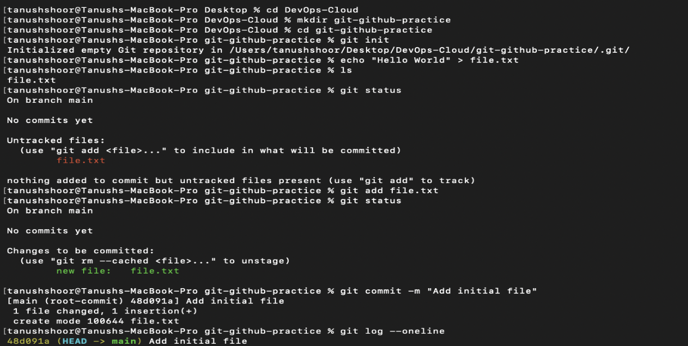
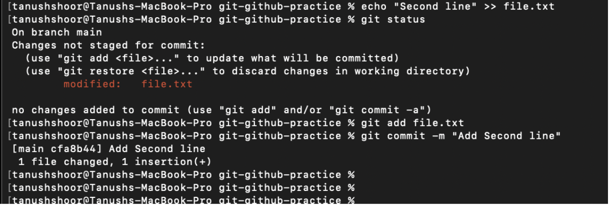
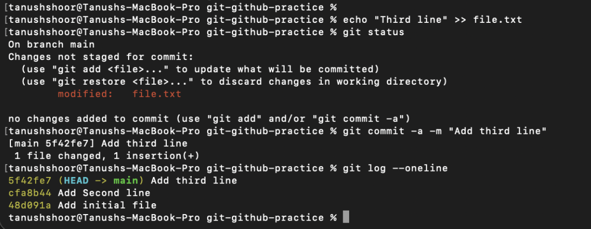
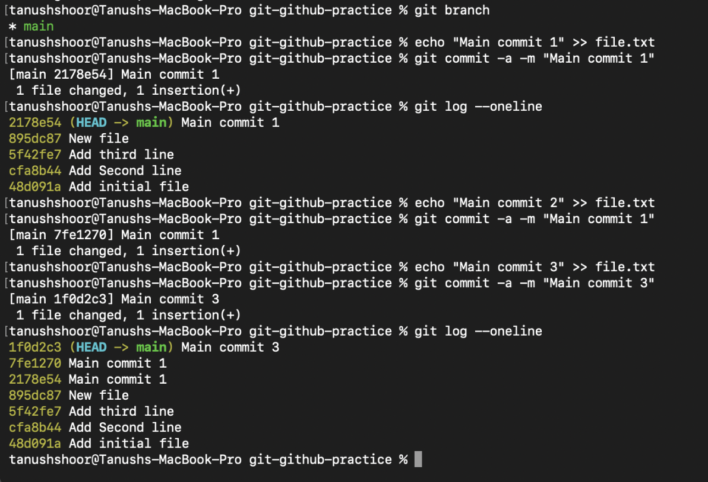
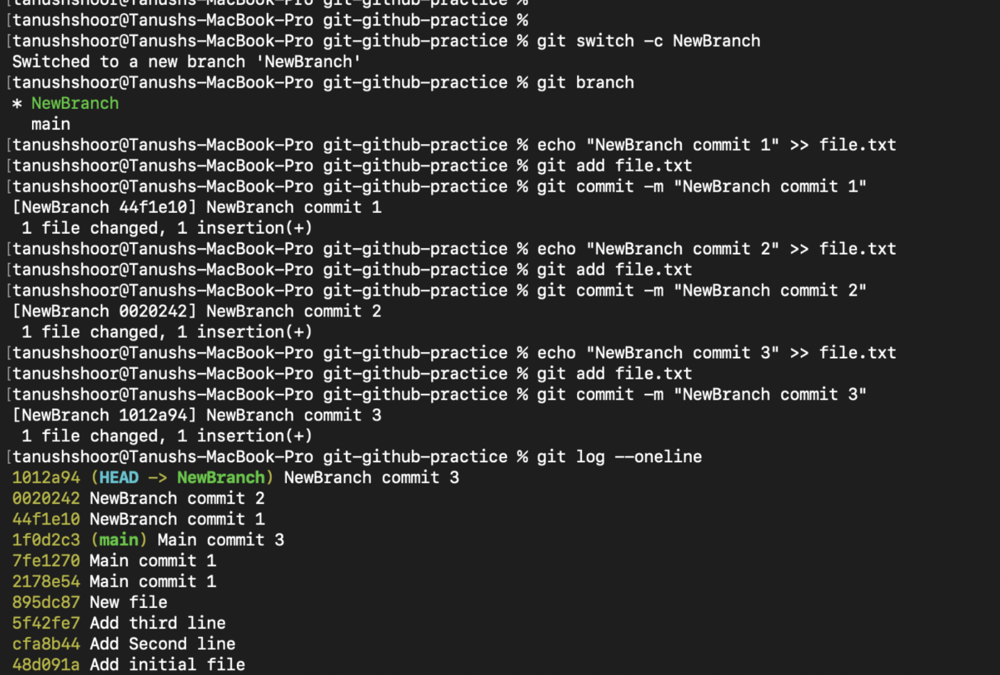
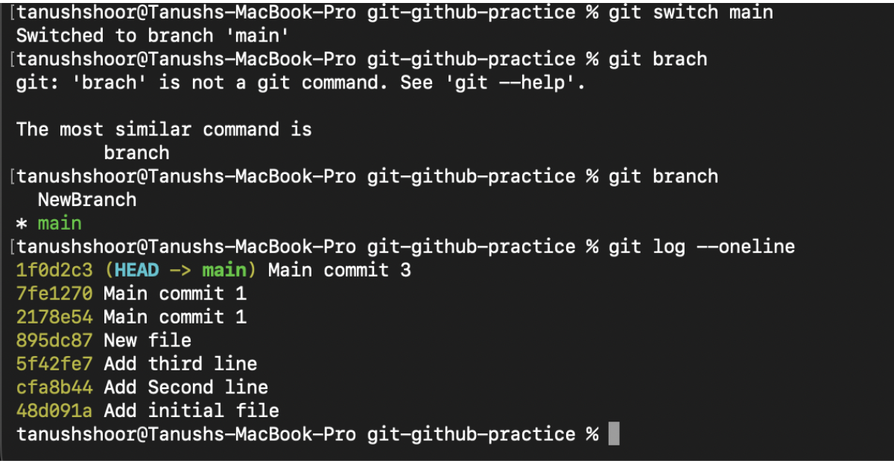
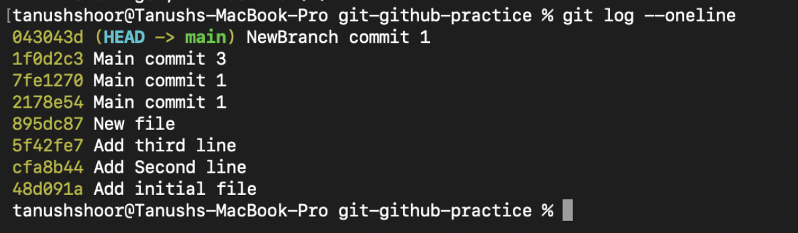
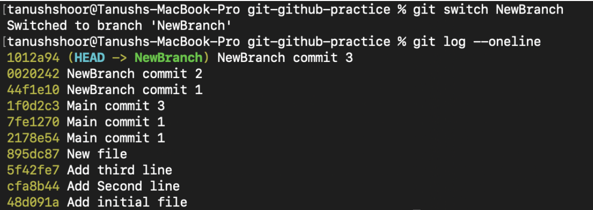
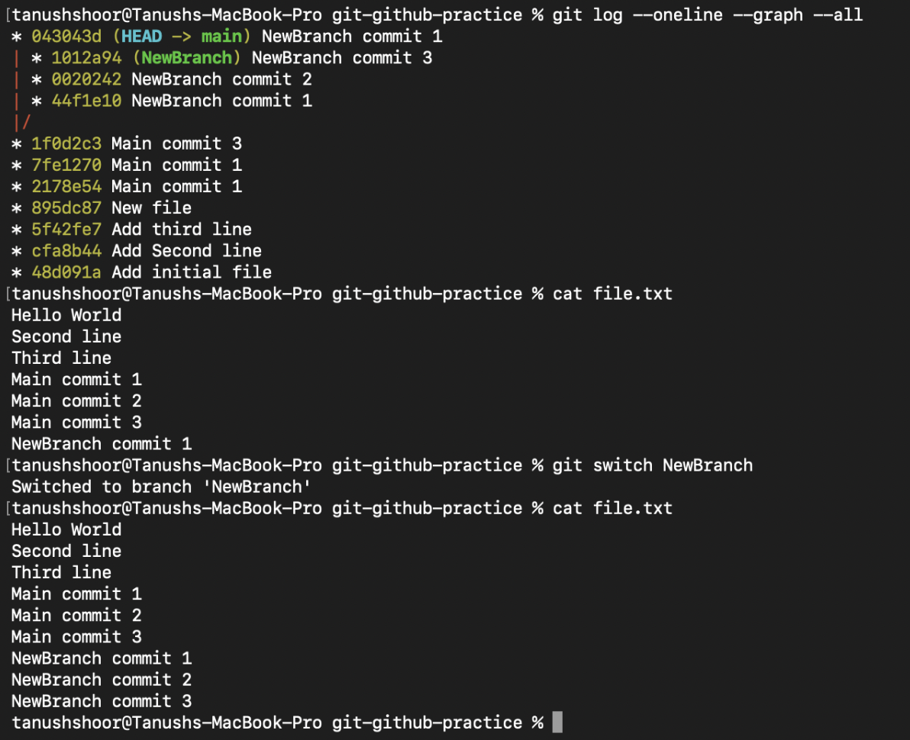
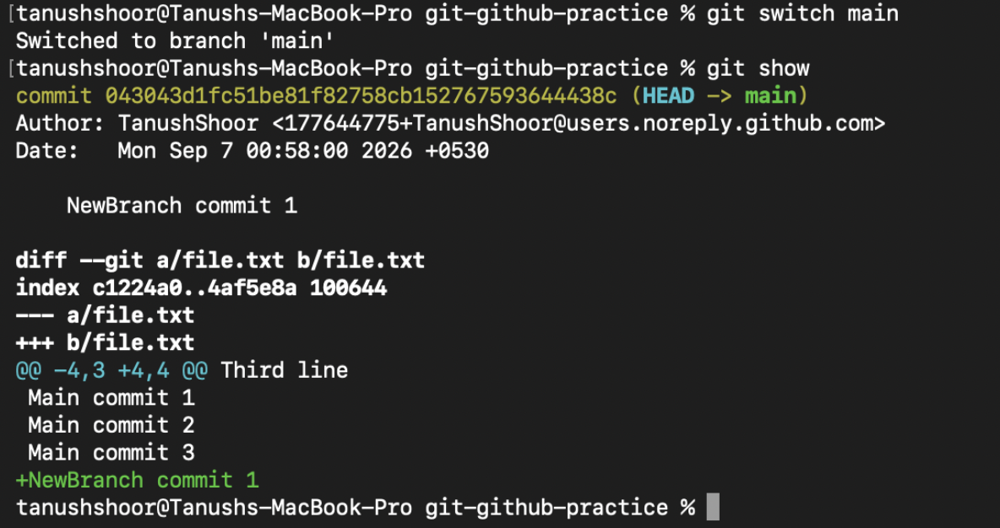

# Task 1:
git commit -a -m
Practice git commit -a -m "message".
Understand the difference between git commit -a -m and git commit -m.
Test both commands and observe the difference.

git commit -m “message”: In this command you commit those files which are already stages. This command requires you to stage the modified files first and then commit them.
git commit -a -m “message”: If the file was created and had already been staged at least once before, then if you run this command after you do further modifications to that file then it will automatically first stage that modified file and then commit it in one step.
So the later command is to only stage and commit those modified or deleted files which git is already tracking (you can check that using “git status” command).
In the following image, I create a file file.txt in a folder where I have initialized git:
- Check its status , to see that it is untracked by git
- Then I modify that file by adding lines into it.
- Then I stage those changes using the “git add file.txt”
- Then I do “git status”, now the git has started to track it.
- Then I commit those changes using git commit -m “message”
- Then using the git log –oneline, I can see what commits I have made in the directory.

Now I make further more changes to the file.txt.
As I do git status, it does not show untracked files but it shows changes not staged.
It means that once I have done git add on any file, git starts tracking it and tracks all the changes that you do. But you need to stage those changes in order to commit them.
So I stage them and then commit them.

But now, here comes the crucial part, if I do a third change to the same file.txt and run git commit -a -m “message” directly, this already stages that file first and then the changes are committed. 

Hence is you have tracked a file once using the git add, git tracks all the changes, so to automate the process of staging and committing into one line, then using the last command, it can be done easily.

# Task 2: Git Cherry-Pick
- Create 2–4 commits in the main branch.
- Use git log to view the commits.
- Create a new branch.
- Make 2–3 commits in the new branch.
- Use git log to identify a specific commit.
- Cherry-pick one specific commit from the new branch into the main branch.
- Verify that the selected commit/change is now available in the main branch.

Committing on the main branch:

Create a new branch:
Create a new branch and the make commits to the same file being in that branch only.

Now copy the hashcode of one of the commits like that of NewBranch 2.

Switching back to the main branch:
Here you will notice that the changes that you made to the file.txt are not logged in here because those changes were made in the “NewBranch” branch and not in the “main” branch.
So now our task is to get the commit made in the “NewBranch” to the main branch.

Now I do cherry -pick command, that is making the same commit I did on another branch to the main branch using the hashcode of the commit made.

Now if you see the logs for main, you will see that the commit you did on the NewBranch is showing on main as well. 

Note: the commit on the other branch has not been deleted from there.

In the screenshot below you can see all the commits made according to time in sorted order with latest on the top.
It is also noticeable that the contents of the file differ when you are in the main branch from when you are in NewBranch.

Important point: the branches don't each contain a separate physical copy of file.txt

So it has been verified that the changes cherry-picked from the NewBranch into the main branch have been verified.
The below assures the above and clearly shows that the commit has been cherry-picked into the main branch.

