# Task 1: Soft Link & Hard Link
Learn the difference between soft links and hard links.
Learn the commands to create both.
Practice creating and deleting soft and hard links.
Prepare for this as an interview question.
Completion:

Links are files or folders which are pointers to the other files or folders.

There are two types of links:

Hard Links: These files are the pointers that actually refer to the actual address of the target file address on the inode table (address of the disk). 
- They never refer to a folder because it can lead to infinite loops and hence crash the whole systems as the system will keep calling to a folder that has another folder which points to the earlier
- If you remove the target file, this hard link will still point to that address on the inode table having addresses and it will still contain the same contents as that of the target file as the data never gets erased from the disk, but as this hard link is on the inode table which points to the same memory location so the data will never be deleted until you delete all the hard links that point to that memory address in the inode table.

Soft Links: These files are the pointers that actually point to the location of the target file or folder in the file system. 
- If you remove the target file, then this pointer file i.e. soft link will point to that location but as nothing is present there, then it will give back nothing.

Soft Link Command: 
ln -s target_file_path soft_file_path
Image where the target file lies and its contents:

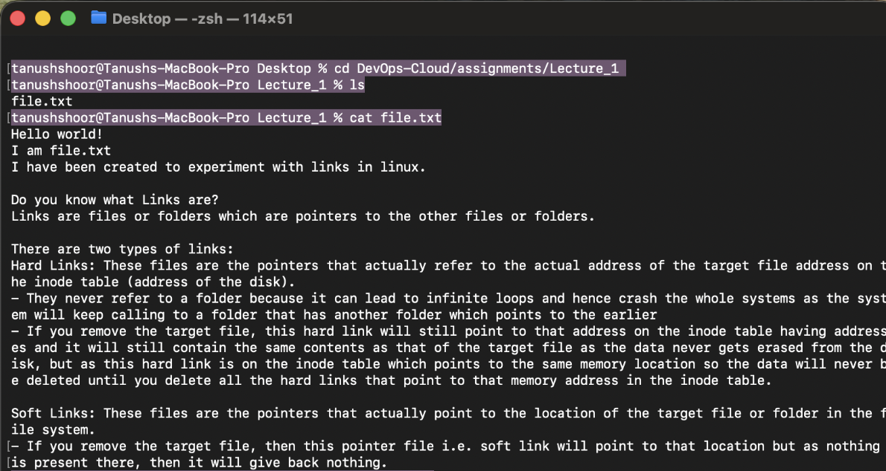

Image about making the soft link to the target file:
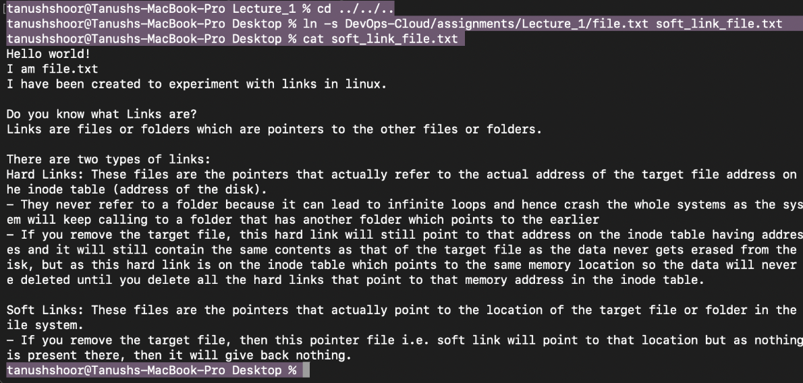

Overall collective screenshot: 
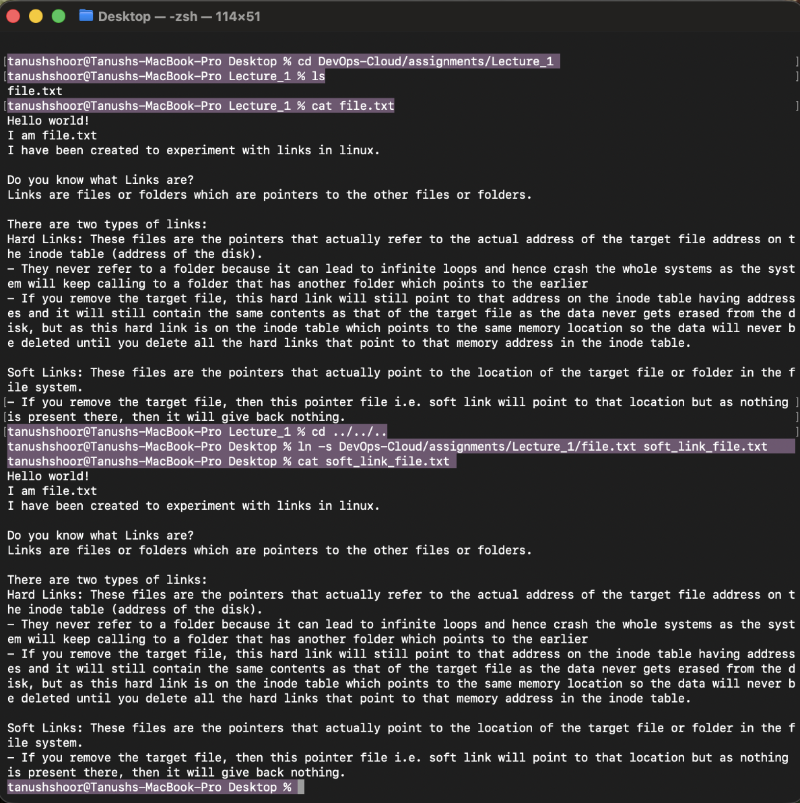

Below image confirms that soft link and the target file are two independent files which do not point to the same inode number:
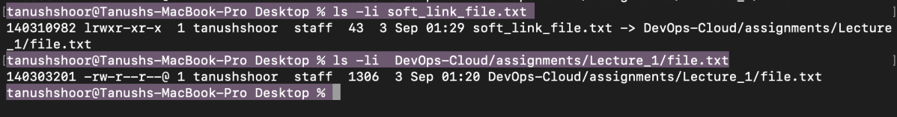

Command to delete the soft link:
rm soft_link_path
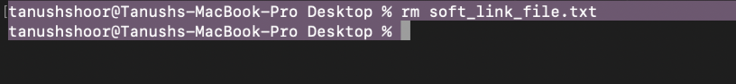

Alternate:
unlink soft_link_path
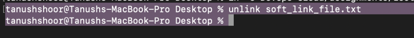

Hard link Create Command:
ln target_file hard_file
 More elaboration: 
ln target_file_path hard_link_path

Creating hard link for the same target file as previous:

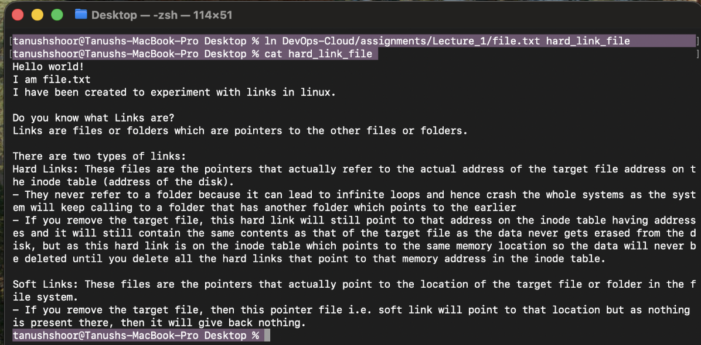

Confirming that the index node (inode) number for target file and hard link is same:
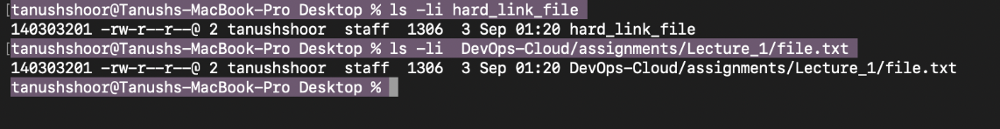

Command to delete the hard link:
rm hard_link_file_path

Below image confirms that by removing the hard link file, the hard link count reduces by 1 as shown below:
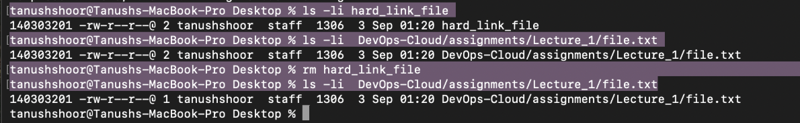

# Task 2:
adduser
vs
useradd
Learn the difference between adduser and useradd.
Understand which command is preferred on Ubuntu/Linux and why.
Create a test user using the recommended command.
These commands are used to create a user in the file system whose info is in the etc/passwd
Difference between adduser and useradd is that:
adduser : This user creating command is very user friendly and when you run
adduser username

This adduser program will run and it will ask you the details, like password setting, for this user you created. This is a high level program for the user where automatic prompts will come to the user for setting passwords etc.

While useradd command is an executable compiled binary file used to create a user in linux. It can take flags like -m which tell the OS to create a home directory for this user.
Command : useradd username -m
Or sudo useradd username -m
It is recommended to use adduser command in Linux/Ubuntu as this handles the default file configurations and permissions and you just have to type in the password. It will also create a home directory for you and run the useradd program in the background with all the safe flags. This makes sure that you have the required permissions and configurations etc for the user account you create with this command.

Did the following using docker’s Linux virtual machine inside a container:
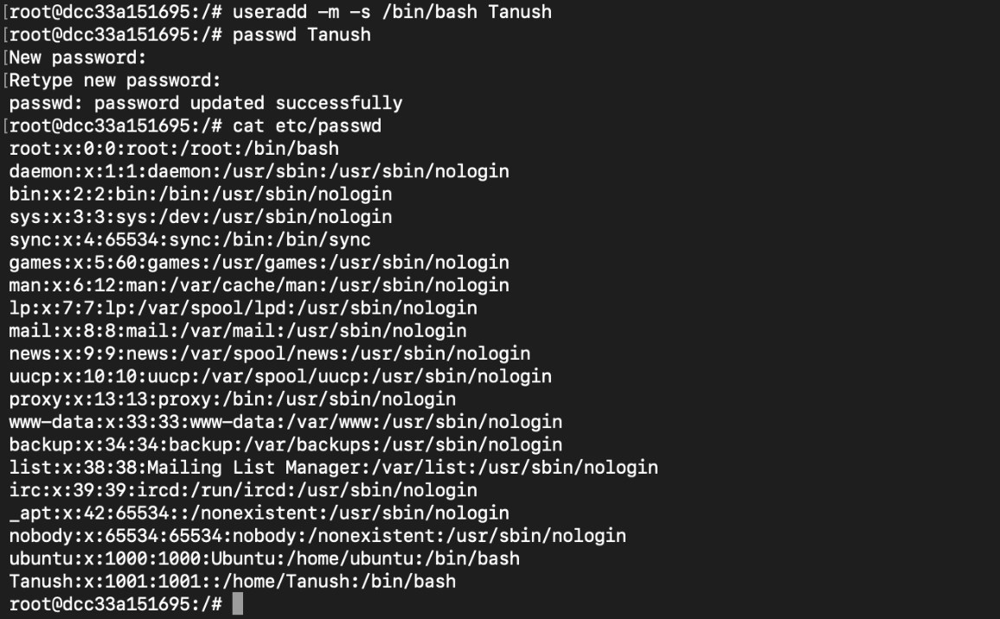

# Task 3:
journalctl
Learn what journalctl is used for.
Learn how to view system and service logs using journalctl.
Practice checking logs for a specific service.
journalctl : This command is used to print the logs of the ongoing background processes about when they were started and the processes like applications etc. It fetches this data from systemd which is started by the Linux kernel to start and manage the processes.

Command to view system and service logs: 
journalctl 
The above command will show all the entries of the processes on the system.

Since I am using macOS, following is the screenshot for printing the logs:
Command for macOS is log show 

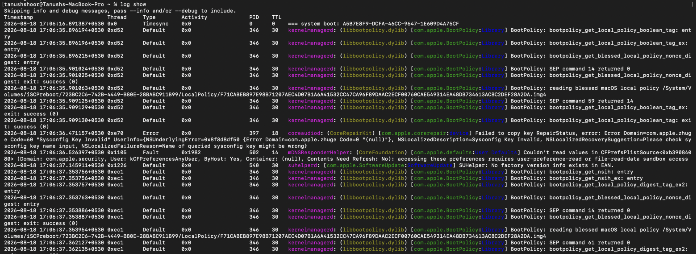

Command to view for a specific service:
journalctl -u service_name
journalctl -u service_name -n 50

In macOS, command is 
launchctl show -predicate “process==”service_name”’ 

launchctl show -predicate “process==”service_name”’ --last 2m
m for min, h for hour, d for days

Reference :https://www.loggly.com/ultimate-guide/using-journalctl/ 

journalctl is like a security logbook at a building gate. It tells you exactly who entered, when they entered, and if they caused a ruckus.
ps or top is like looking at a live security camera inside the building. It tells you exactly who is standing in the lobby right now and what they are doing.
