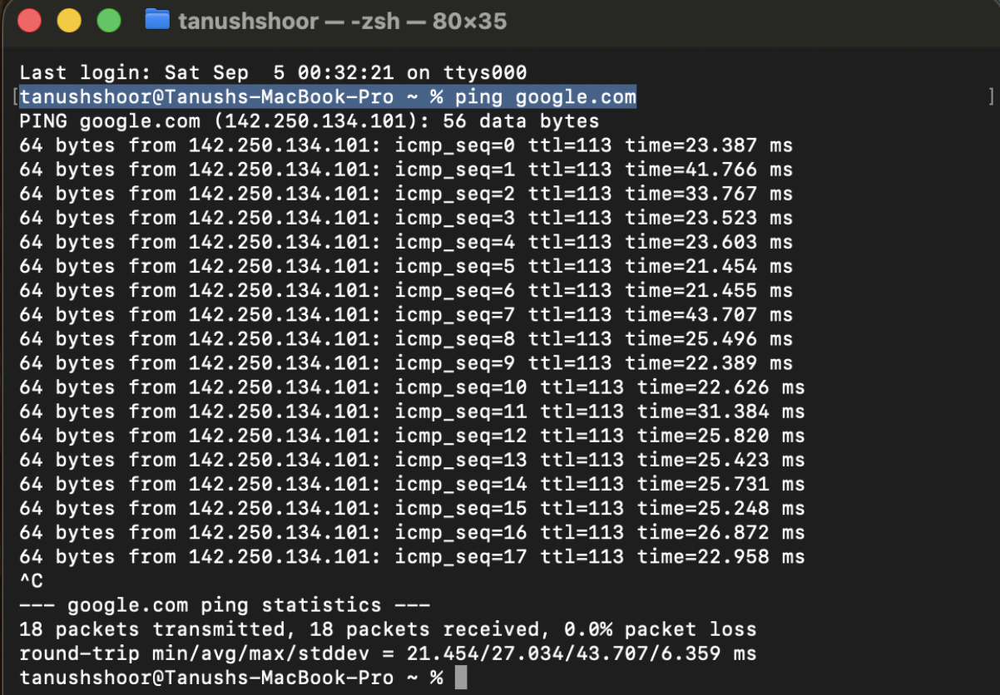
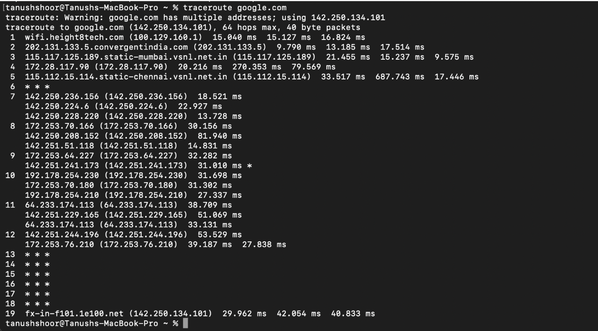
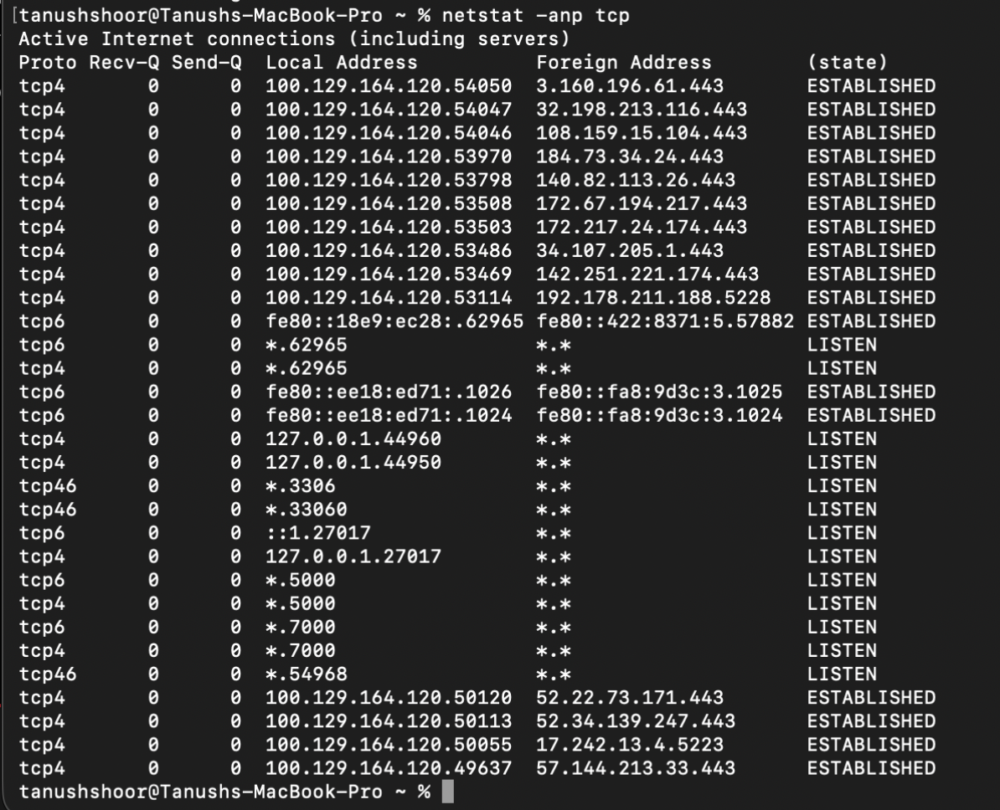
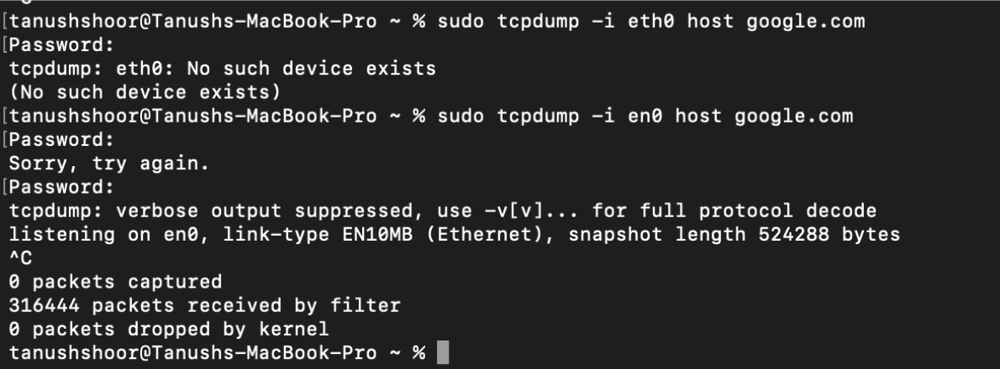
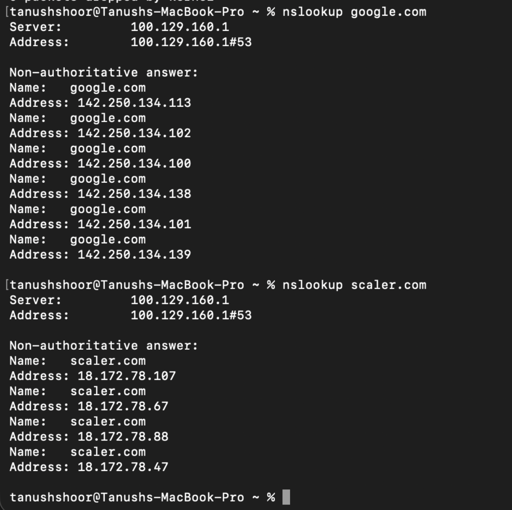
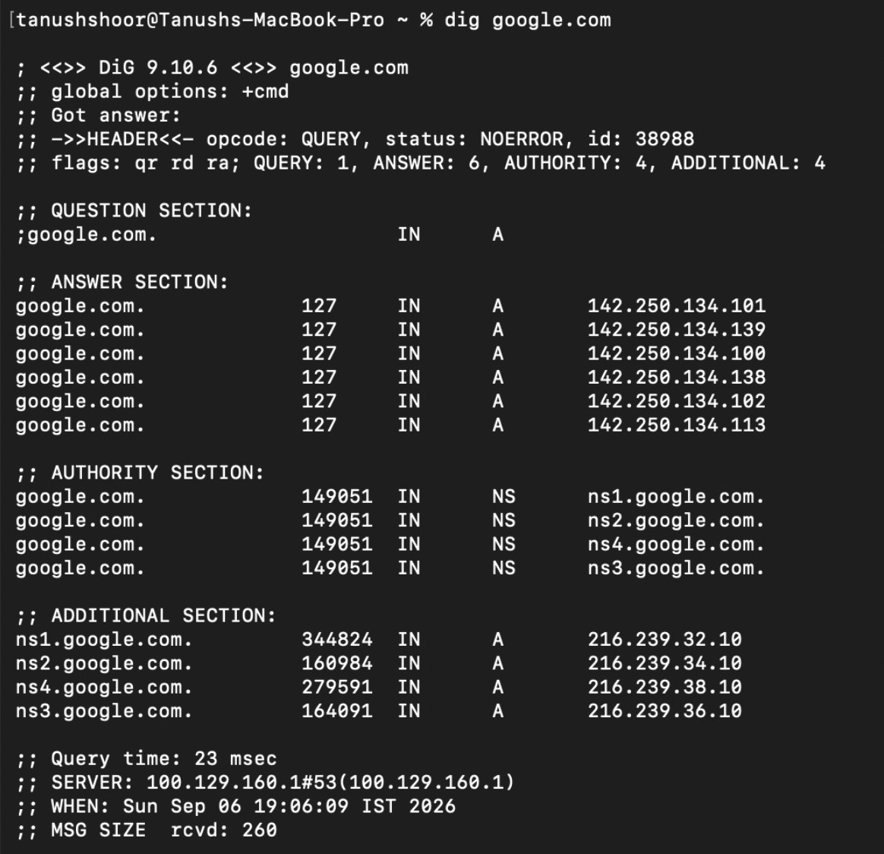
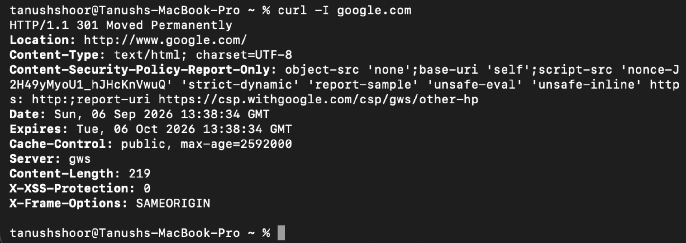
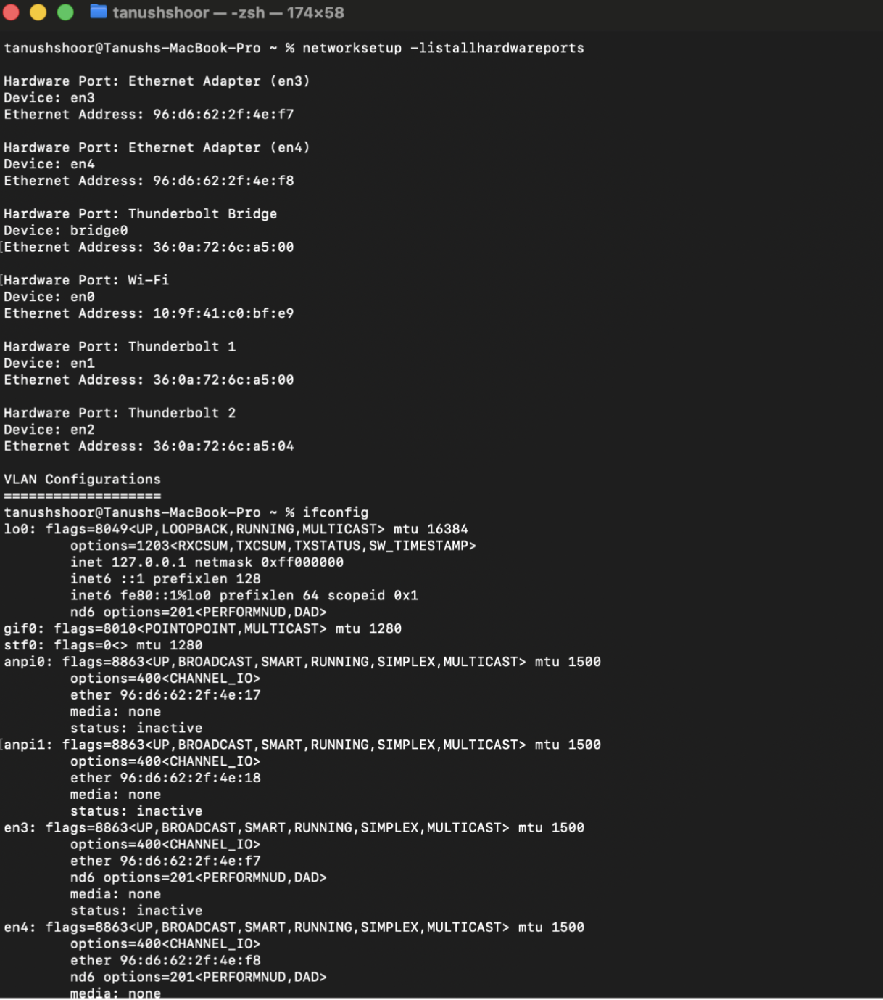

Network-Troubleshooting
Troubleshooting Google.com Connectivity Issues
ping command: this command is used to check if a particular ip address or a host is reachable or not in the whole network of routers etc.
In this, my system sends a data packet to the IP address of google.com which is of 56 of information + 8 bytes for ICMP header+ 20 bytes of IP header = 84 bytes and it receives back the same from google.com

traceroute : 
Purpose: Identify the route packets take to reach google.com and see where delays or failures occur.

netstat -tuln
This command is used to list down all the ports that are listening right now and are in use.
The above command is ignored by mac, So I had to use the following command as the alternate:
netstat -anp tcp

telnet 
This command is used to check connectivity to a host in the network.
Command : telnet google.com 80
The following works for MacOS: nc -vz google.com 80

tcpdump
This is used to list down all the requests coming to my computer or are being sent from or just passing by.
Command: sudo tcpdump -i eth0 host google.com

It is not supported on mac as mac names  sudo tcpdump -i en0 host google.com

nslookup
This command is used to get the ip addresses from the DNS server for the host name you enter.
Command : nslookup hostname

dig
Purpose: Provides detailed DNS query information about google.com, including its IP address and authoritative DNS servers.
Command: dig google.com
Explanation: This command gives a detailed view of DNS queries. It’s useful for seeing how DNS queries are resolved and finding out additional details about the domain's DNS settings.

Curl
This command is used to Test HTTP/HTTPS connectivity to google.com.
It is mainly used as a terminal browser that can be used to download the html, css js etc from the hostname response.
-I flag only cares about the server’s technical information and not about the visual content.
Command: curl -I https://www.google.com

arp -a
The above command is used to see the mappings of the ip addresses to their mac address in the same network only connected to the same router.

systemctl status NetworkManager

The above command is used to check the health og NetworkManger which manages the whole connectivity of the device to the network.
The above does not run on macOS so I have attached the screenshot with alternate commands.
