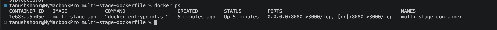
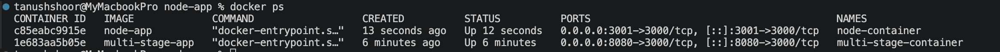
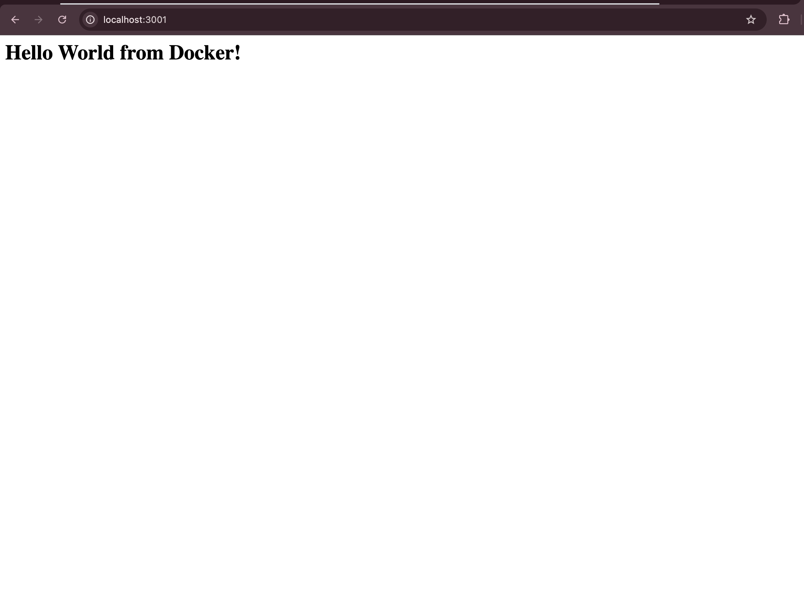
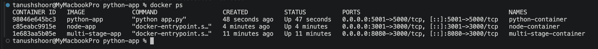
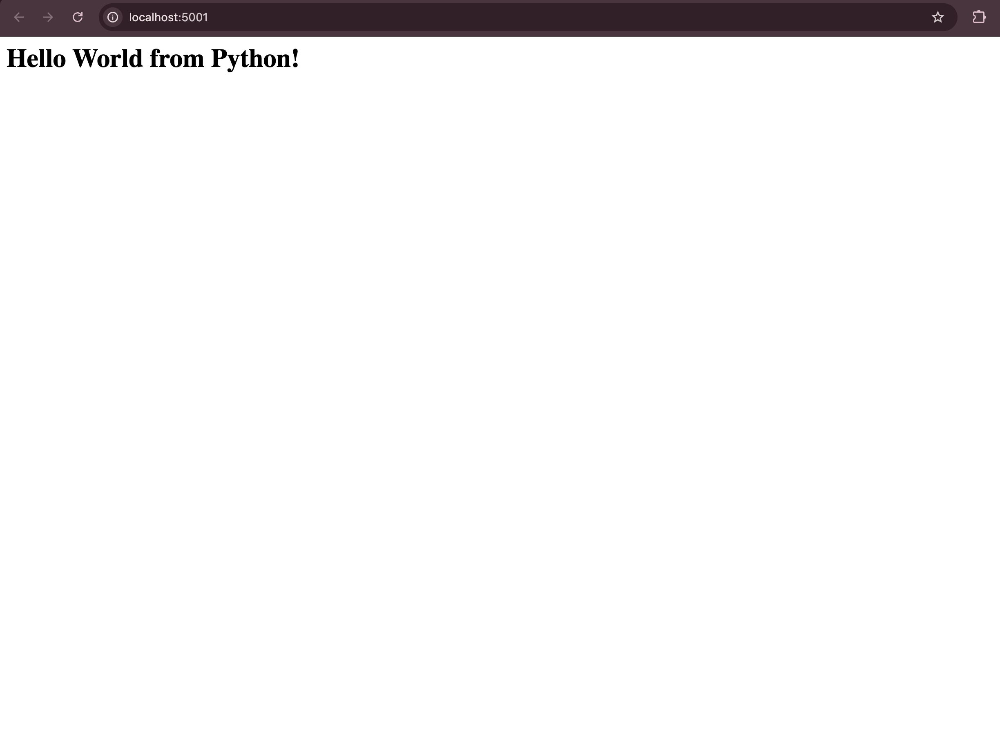
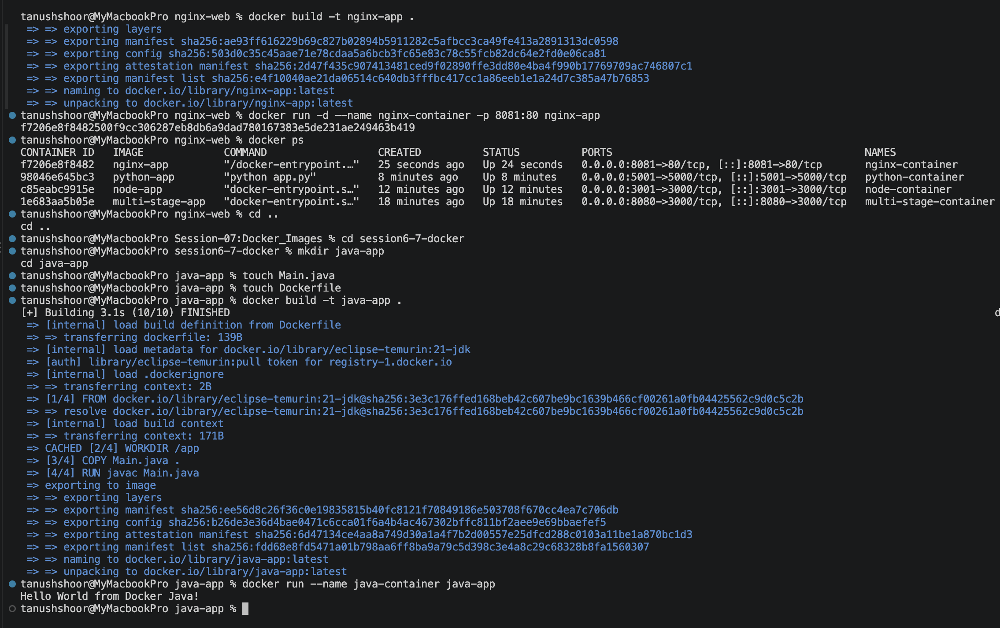
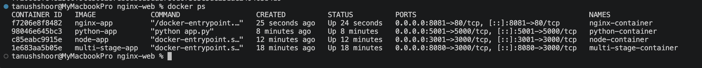
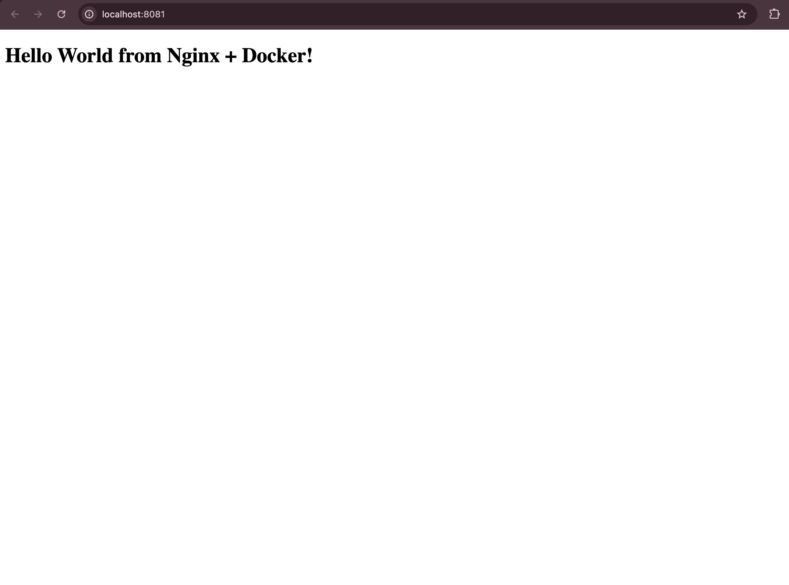

Tanush Shoor
24BCS10265

Docker Multi-Stage Build Homework
Task 1: Run Multi-Stage Dockerfile
Clone the repository containing the multi-stage Dockerfile.
Build the Docker image using the multi-stage Dockerfile.
Run a container from the image.
Access the application running inside the container.
Verify that the application displays:
 Hello World from Docker multi-stage build
Verify the running container using docker ps.
Confirm that the application is running on port 8080.

Task 3: Docker Application Deployment
Deploy at least 3 different types of applications using Docker, such as:
Node.js

Python

Java

nginx

