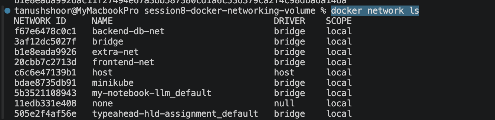
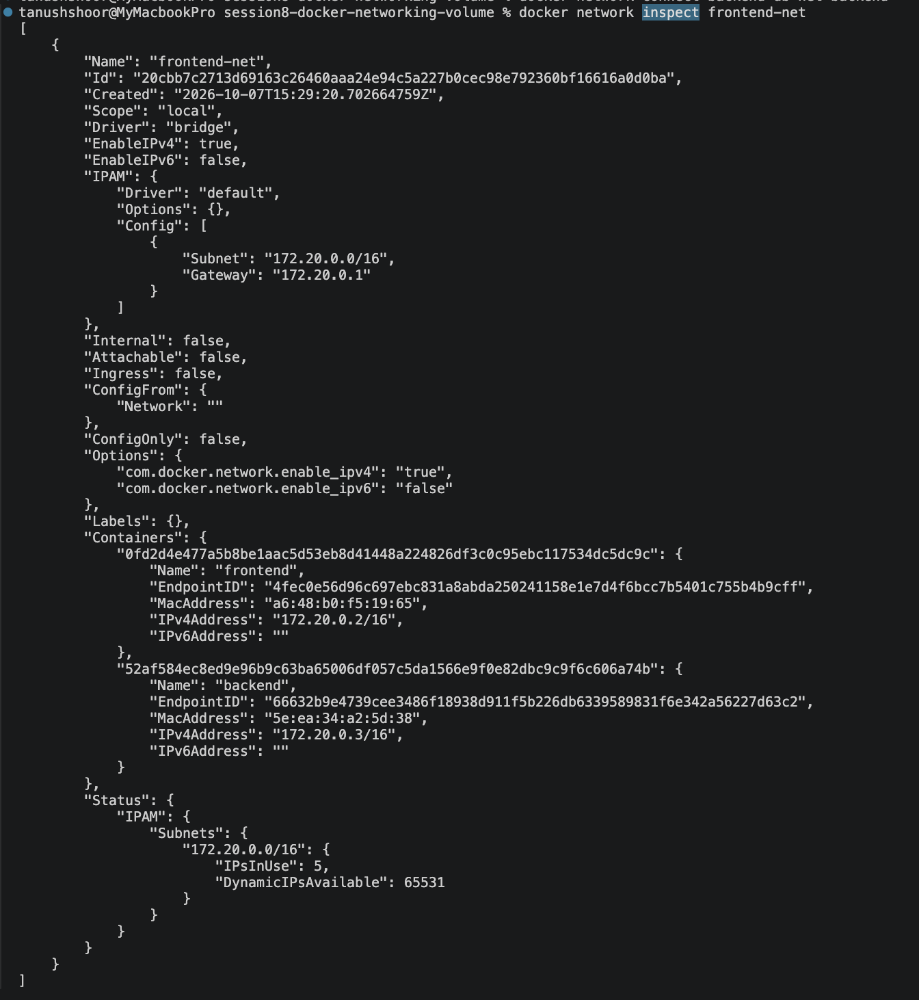
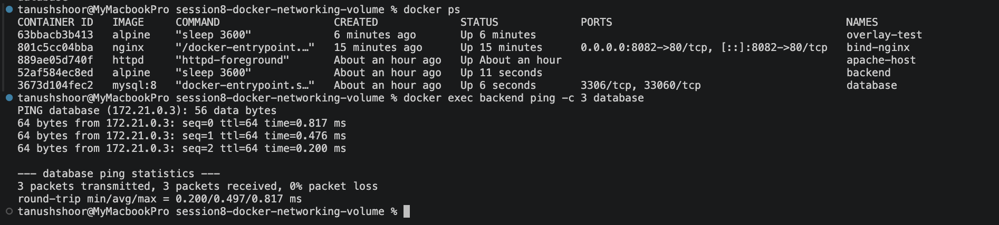
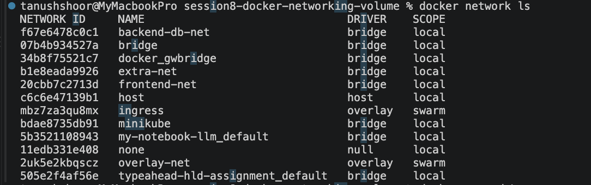
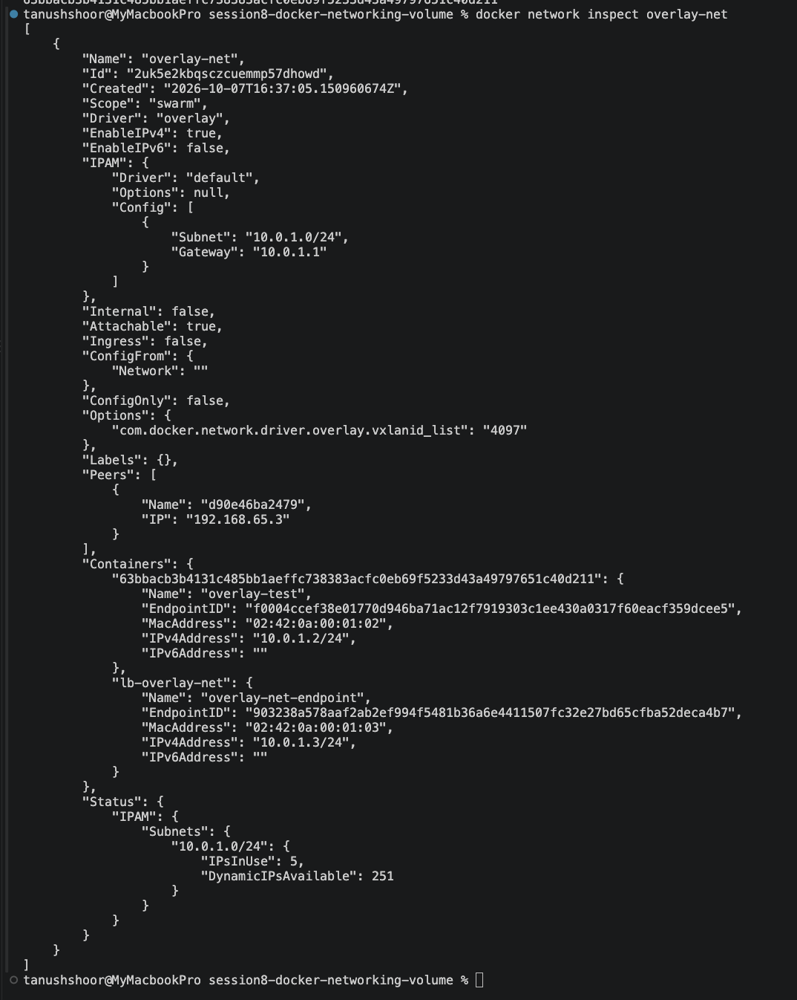

# Docker Networking & Volume Assignment

## Task 1 — Container Networking

Created:
- frontend
- backend
- database

Networks:
- frontend-net
- backend-db-net
- extra-net

Backend connected to:
- frontend-net
- backend-db-net

### Evidence

connectivity screenshot:

---

## Task 2 — Host Network

Apache2 was deployed using the host network.

Command:

docker run -d --name apache-host --network host httpd

Application accessed at:

http://localhost:80

### Evidence

---

## Task 3 — Bind Mount

Created local index.html containing:

Hello students

Mounted it into an Nginx container.

The HTML file was modified without restarting the container and the changes were reflected immediately.

### Evidence

---

## Task 4 — Overlay Network

Created an overlay network using Docker Swarm.

Command:

docker network create -d overlay --attachable overlay-net

### Use Cases

Overlay networks allow containers/services running on different Docker hosts to communicate as if they were connected to the same logical network.

They are commonly used with Docker Swarm and distributed container deployments.

### Evidence

docker network ls screenshot:

### Evidence — Overlay Network
