# Kubernetes Fundamentals

## Student Details

**Name:** Tanush Shoor  
**Rollno:** 24BCS10265
**Course:** DevOps  
**Topic:** Kubernetes Fundamentals

---

# Task 1 — Minikube Installation and Configuration

Minikube was already installed on the system.

### Check Minikube Version

minikube version 

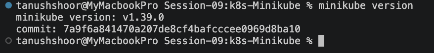

Starting minikuber:

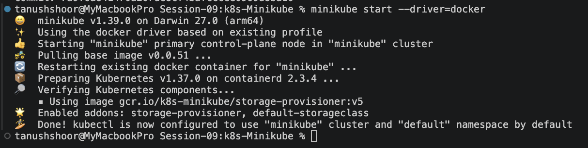

# Task 2 — Verify Kubernetes Cluster Status
minikube status
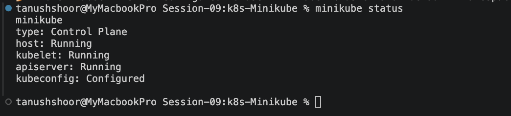

Check K8s nodes

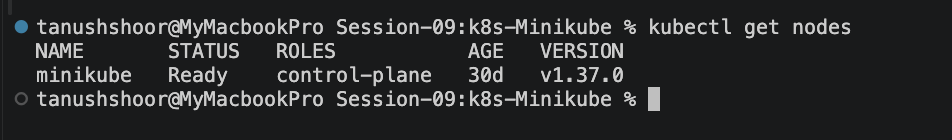

Check all system Pods
kubectl get pods -A

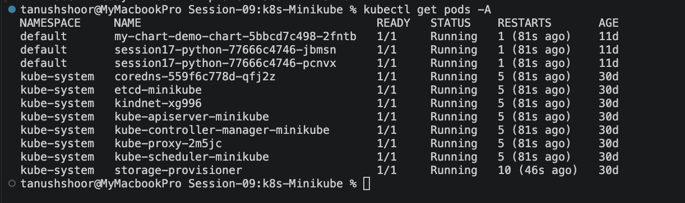

# Task 3 — Explore Kubernetes Architecture
kubectl cluster-info

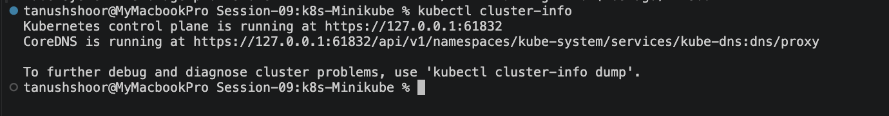

kubectl get nodes -o wide

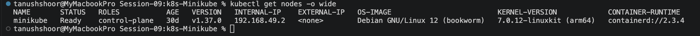

kubectl get pods -A -o wide

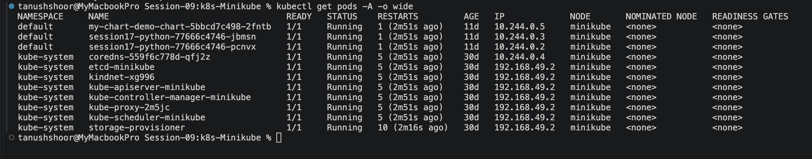

Kubernetes Architecture
A Kubernetes cluster consists mainly of a Control Plane and Worker Nodes.
Kubernetes Cluster
│
├── Control Plane
│   ├── API Server
│   ├── etcd
│   ├── Scheduler
│   └── Controller Manager
│
└── Worker Node
    ├── kubelet
    ├── Container Runtime
    └── kube-proxy
Main Components
- API Server – Provides the main interface for communicating with the Kubernetes cluster.
- etcd – Stores Kubernetes cluster configuration and state.
- Scheduler – Assigns Pods to appropriate nodes.
- Controller Manager – Maintains the desired state of Kubernetes resources.
- kubelet – Manages Pods and containers on worker nodes.
- Container Runtime – Runs the containers.
- kube-proxy – Handles network communication for Kubernetes Services

# Task 4 — Kubernetes Basic Objects and Commands
Kubernetes provides several basic objects for managing applications.
Some commonly used objects and commands are:
Object / Command	Purpose
Pod	Runs one or more containers
Deployment	Manages application Pods
Service	Provides network access to Pods
kubectl get	Displays Kubernetes resources
kubectl describe	Shows detailed resource information
kubectl scale	Changes the number of replicas

# Task 5 — Kubernetes Basics Hands-on

kubectl get deployments
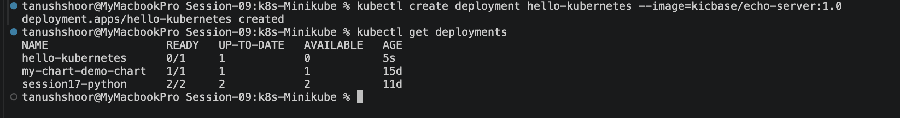

kubectl get pods

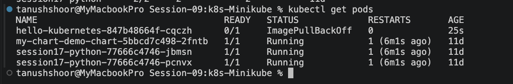

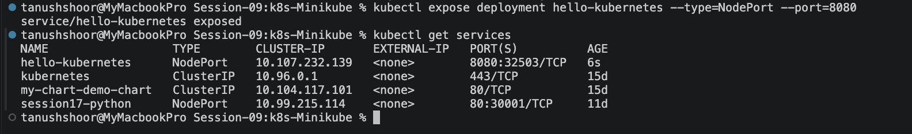

minikube service hello-kubernetes
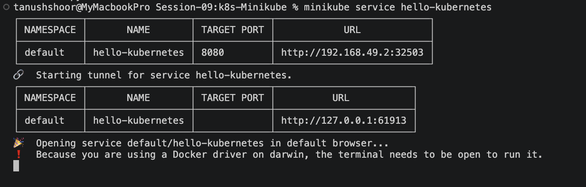

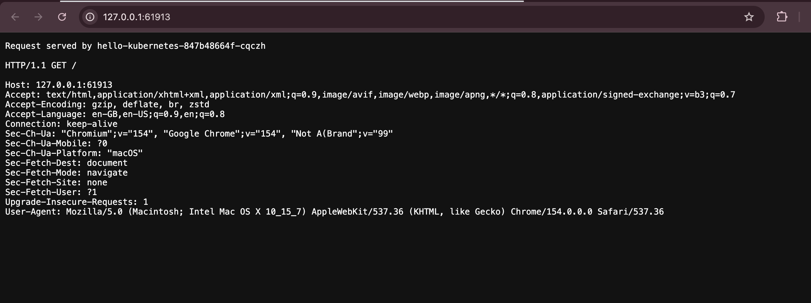

Scale the Deployment
The deployment was scaled to multiple replicas.

kubectl get pods
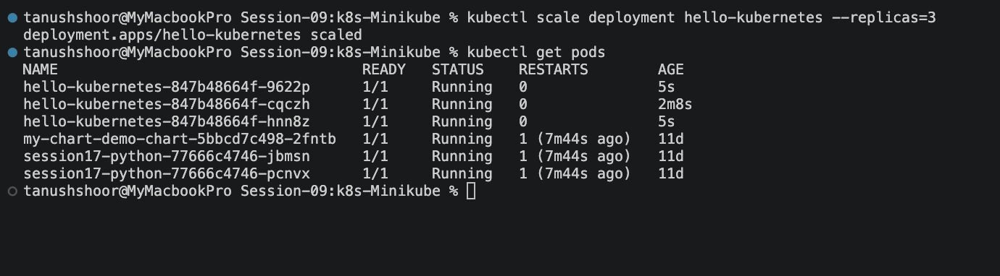

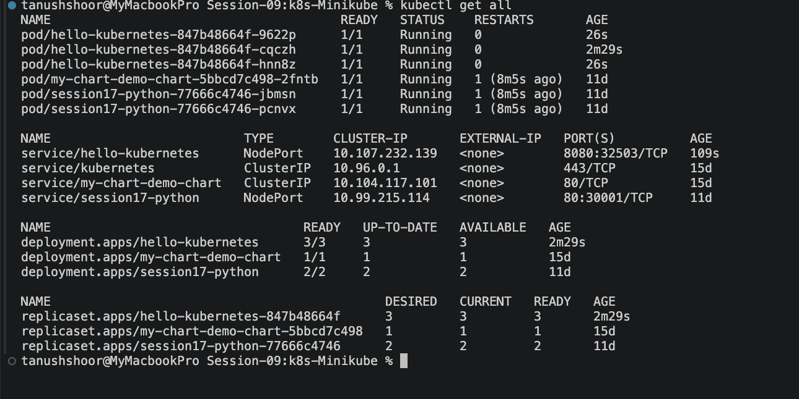

