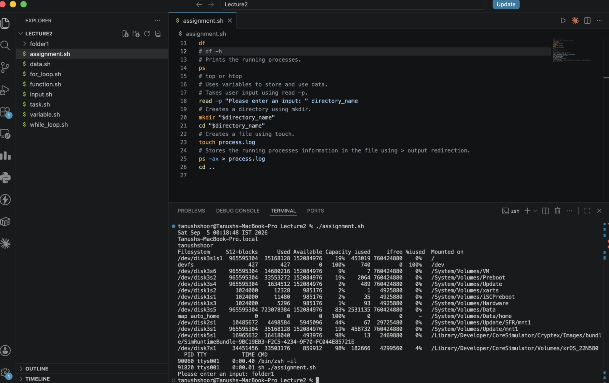
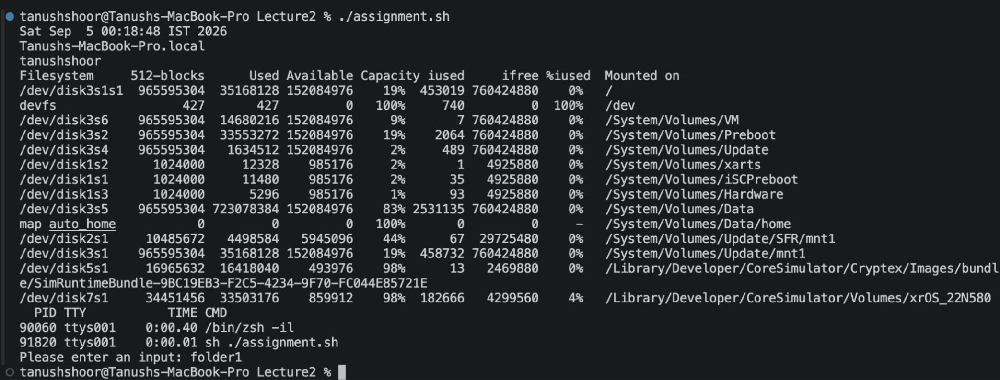

Task: System Information Script
Create a shell script that:
Prints the current date.
Prints the hostname.
Prints the username.
Prints the disk usage.
Prints the running processes.
Uses variables to store and use data.
Takes user input using read -p.
Creates a directory using mkdir.
Creates a file using touch.
Stores the running processes information in the file using > output redirection.
Commands to Use
mkdir
touch
echo
df
ps
read -p
Variables
> output redirection
Submission
Create a public GitHub repository.
Push the completed shell script to the repository.
Readme.md file with all commands output.

# Prints the current date.
date
# to store the value of date into a variable:
# date=$(date)
# echo "$date"
# Prints the hostname.
hostname
# Prints the username.
whoami
# Prints the disk usage.
df
# df -h
# Prints the running processes.
ps
# top or htop
# Uses variables to store and use data.
# Takes user input using read -p.
read -p "Please enter an input: " directory_name
# Creates a directory using mkdir.
mkdir "$directory_name"
cd "$directory_name"
# Creates a file using touch.
touch process.log
# Stores the running processes information in the file using > output redirection.
ps -ax > process.log
cd ..

Terminal Image:

