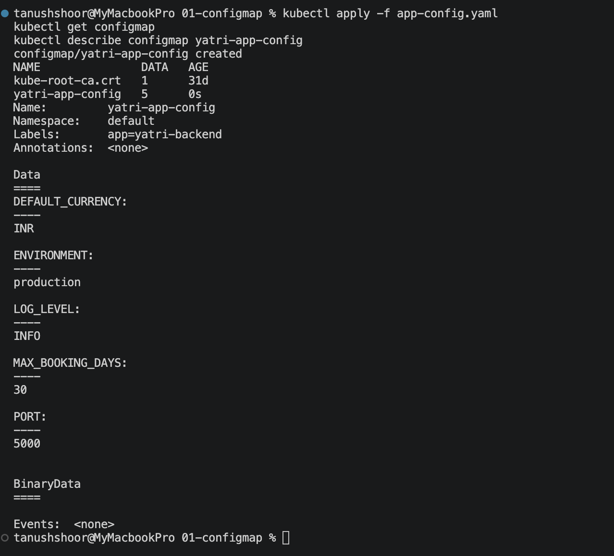
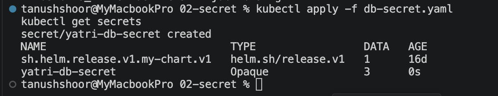
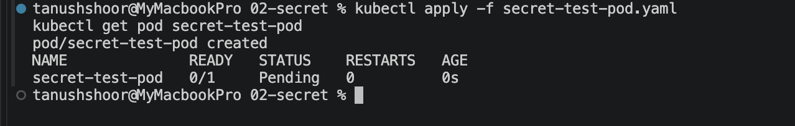
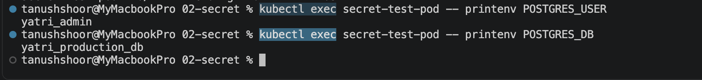
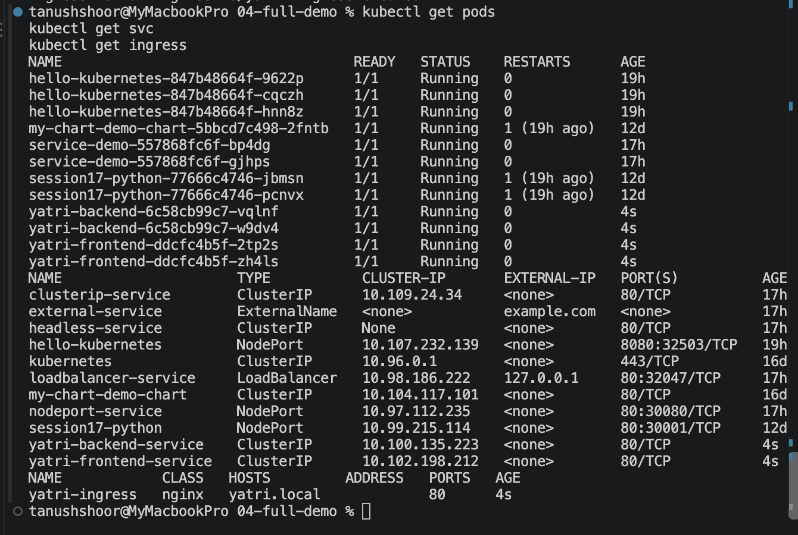
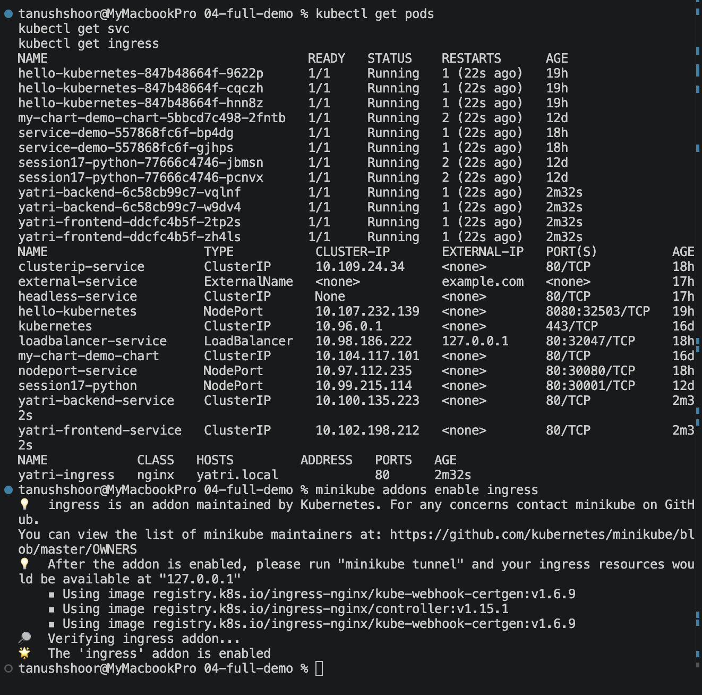
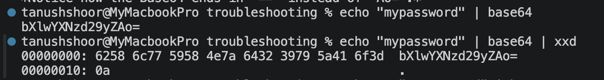
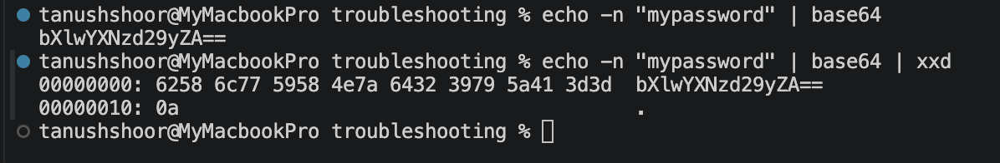
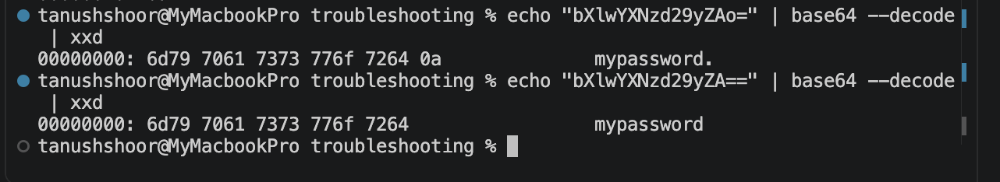

### ConfigMap Verification

The ConfigMap was successfully created and its stored configuration values were verified.



Task 2 — Secret
### Secret Creation and Verification

The Kubernetes Secret was successfully created and verified.


### Secret Injection Pod

A test Pod was created with the Secret injected as environment variables.


### Secret Injection Verification

The Secret values were successfully injected into the Pod and verified from inside the container.



### Password Injection Verification

The password variable was verified without exposing its actual value.


Task 3 — Ingress

### Ingress Resources Verification

The application Pods, Service, and Ingress resource were successfully deployed and verified.


### Application Access Through Ingress

The application was successfully accessed through the configured Kubernetes Ingress.




# Task 4 — Ingress vs Ingress Controller
## Ingress

Ingress is a Kubernetes API object that defines rules for routing HTTP/HTTPS traffic to Services.

## Ingress Controller

An Ingress Controller is the component that actually implements those routing rules and handles incoming traffic.

## Difference

| Ingress | Ingress Controller |
|---|---|
| Defines routing rules | Implements routing rules |
| Kubernetes API resource | Running software/component |
| Specifies desired routing | Performs actual traffic routing |

Both are required because the Ingress defines **what should happen**, while the Ingress Controller actually **performs the routing**.

Examples of Ingress Controllers include NGINX, Traefik and HAProxy.

# Task 5 — Troubleshooting

## Problem

The PostgreSQL application rejected the password even though the password appeared to be correct.

## Investigation

The following command was used:

```bash
echo "mypassword" | base64
```
The problem is that echo adds a trailing newline character.
```bash
echo "mypassword" | xxd
```

The output ends with 0a, which represents the newline character.



## Root Cause
The newline was also Base64 encoded. Therefore, the application received:

```bash
mypassword\n
```


instead of:
```bash
mypassword
```

### Fix
Use echo -n to prevent the trailing newline:
```bash
echo -n "mypassword" | base64
```


The corrected Base64 value is:
```bash
bXlwYXNzd29yZA==
```


### Verification
The corrected value was decoded and verified to contain only the intended password without the trailing newline.


Conclusion
The issue was caused by an unwanted newline character introduced by echo. Using echo -n fixed the Base64 encoding and prevented the incorrect password from being passed to the application.

