# Session 13 - Storage, HPA & Probes Homework

Using namespace `s13` for Task 1 and 2, and `production-webapp` for the mini project. The metrics server has been turned on (`minikube addons enable metrics-server`).

# Task 1: Kubernetes Volumes

Written up in [01-kubernetes-volumes/README.md](01-kubernetes-volumes/README.md), covering emptyDir, hostPath, PV, PVC, StorageClass and dynamic provisioning along with examples.

# Task 2: HPA Hands-on

Files: [04-hpa/deployment.yaml](04-hpa/deployment.yaml), [04-hpa/service.yaml](04-hpa/service.yaml), [04-hpa/hpa.yaml](04-hpa/hpa.yaml), plus the load generator I built: [04-hpa/load-generator.yaml](04-hpa/load-generator.yaml) (3 busybox pods hitting the service in a loop).

HPA settings: min 1, max 5, targeting 50% CPU (relative to the 100m request).

**1. Deploy the application**

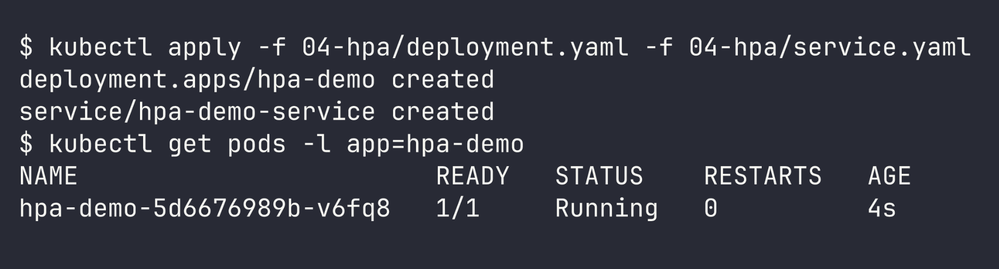

**2 & 3. Configure and verify HPA** - idle sits at 0% CPU with 1 replica.

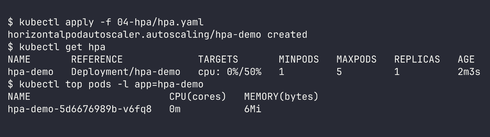

**4 & 5. Deploy load generator and increase load**

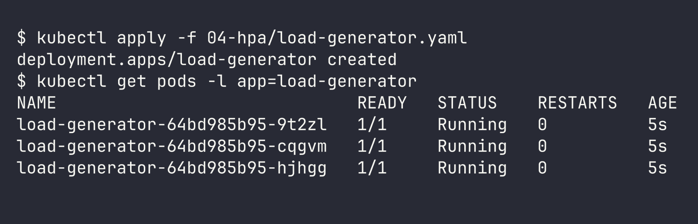

**6 & 7. Observe CPU utilization and pod scaling**

CPU climbed to 138%, which triggered the HPA to scale from 1 up to 3 pods. Once the traffic was shared across them, CPU settled back down to roughly 25-57%.

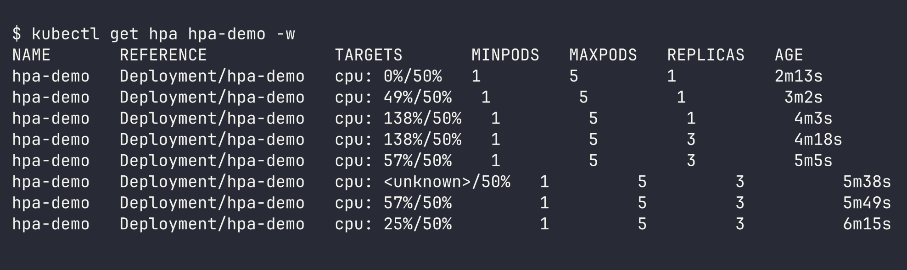

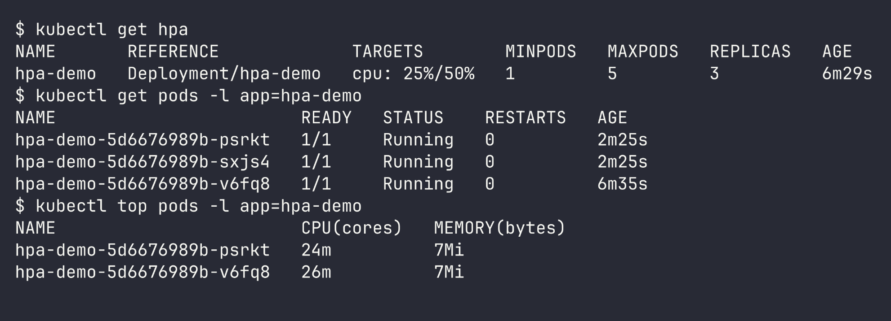

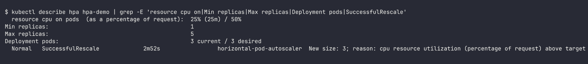

**Scale down after removing the load**

```bash
kubectl delete -f 04-hpa/load-generator.yaml
```

Once the 5 minute stabilization window passed it stepped down 3 -> 2 -> 1:

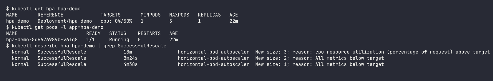

The formula HPA applies: `desired = ceil(current replicas * current CPU / target CPU)` = ceil(1 * 138 / 50) = 3.

# Task 3: Mini Project

Files: [mini-project/](mini-project/) (namespace, pvc, deployment with startup/readiness/liveness probes, service, hpa)

**Deploy everything**

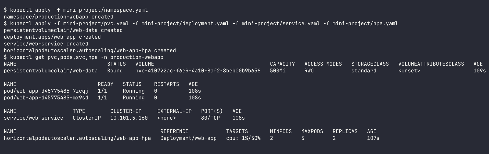

**Storage persistence** - wrote a file into `/data`, removed the pod, then read it back from the replacement pod.

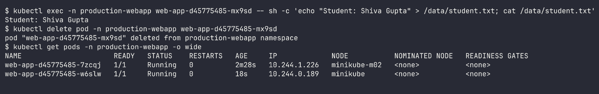

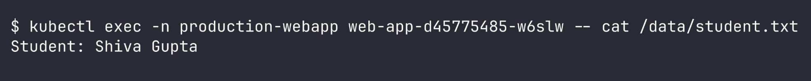

Note: minikube's hostpath provisioner keeps the data on a single node, so on my 2 node cluster I verified the new pod that spun up on the same node (`minikube`). On a cloud cluster backed by EBS the volume would follow the pod instead.

**Service**

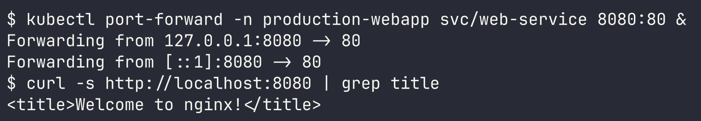

**Probes and volume mount**

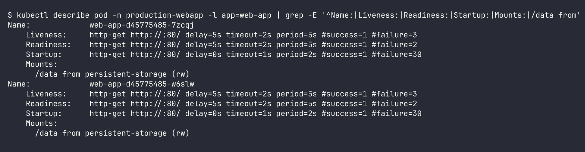

- startup probe: allows nginx up to 60s (30 x 2s) to come up before the other probes kick in
- readiness probe: the pod only receives traffic once `/` returns 200
- liveness probe: the container is restarted if `/` fails 3 times

**HPA scaling** - launched 8 load generator pods to drive CPU past the 50% target.

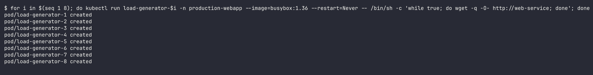

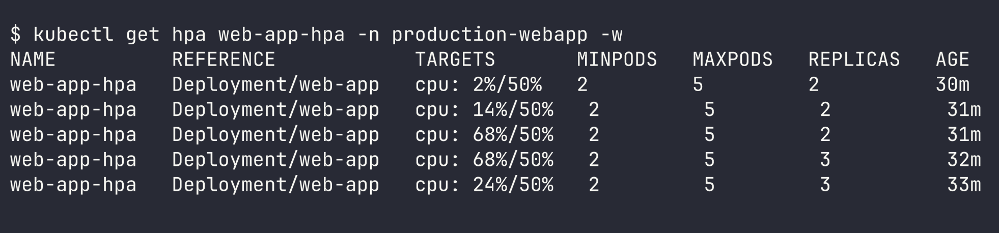

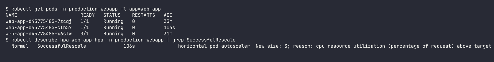

CPU reached 68% and the HPA scaled from 2 to 3 pods. During this heavy load one pod briefly showed `0/1` because its readiness probe (2s timeout) failed, so it was pulled out of the service until it could respond again. That's the readiness probe working as intended.

Cleanup:

```bash
kubectl delete pod -n production-webapp -l run
```