# Session 14 - Kubernetes Troubleshooting Homework

All of this was carried out in the `s14` namespace.

# Task 1: Kubernetes Commands

Pods used: [01-kubectl-get/pod.yaml](01-kubectl-get/pod.yaml), [02-kubectl-describe/demo-pod.yaml](02-kubectl-describe/demo-pod.yaml), [03-kubectl-logs/pod.yaml](03-kubectl-logs/pod.yaml), [04-kubectl-exec/pod.yaml](04-kubectl-exec/pod.yaml)

**kubectl get** - a fast look at resource status (READY, STATUS, RESTARTS).

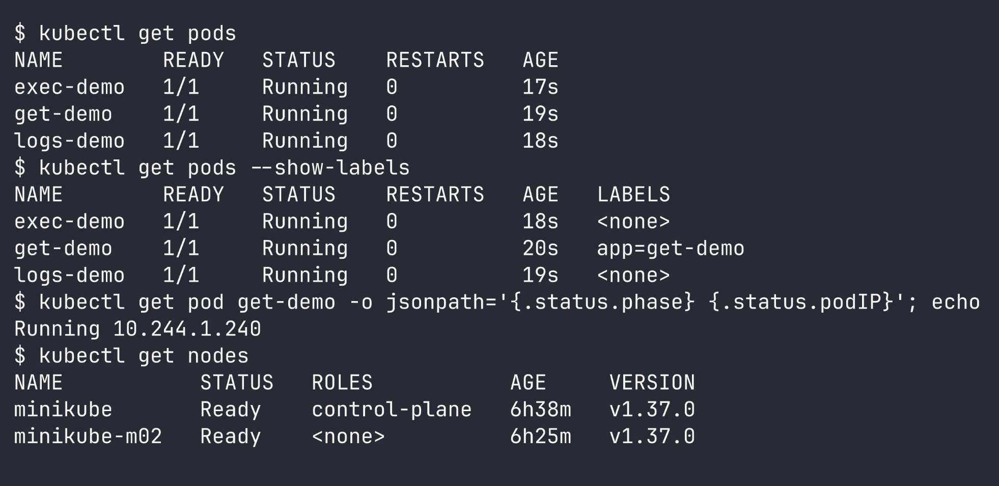

**kubectl get -o wide** - adds the pod IP and the node it's scheduled on.

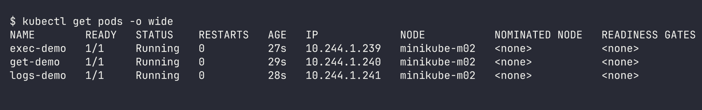

**kubectl describe** - every detail of a single object: node, IP, image, container state, plus events listed at the bottom.

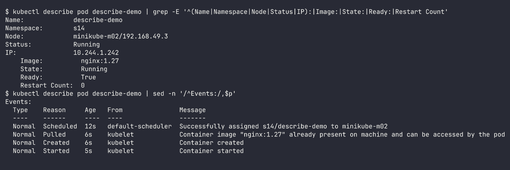

**kubectl logs** - the container's stdout/stderr. `--tail`, `--since`, `-f`, `--previous` come in handy.

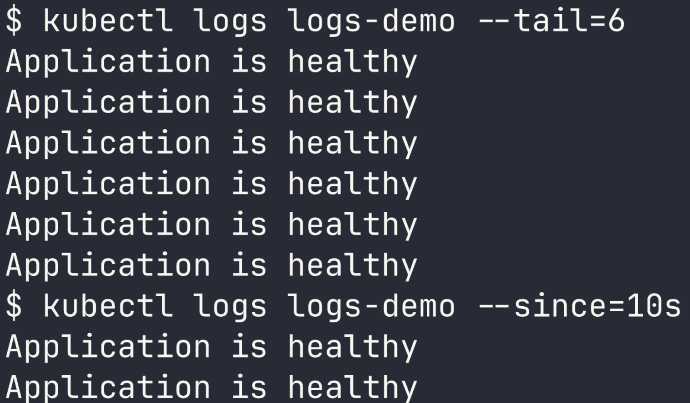

**kubectl exec** - execute a command inside the container to inspect files, processes and connectivity from within.

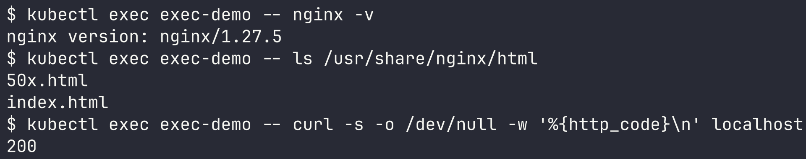

**kubectl events** - a record of what occurred in the cluster (scheduling, pulling, failures).

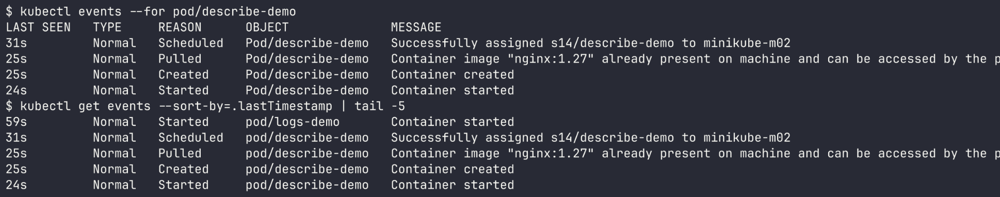

**kubectl explain** - documentation for any field of a resource, straight from the terminal.
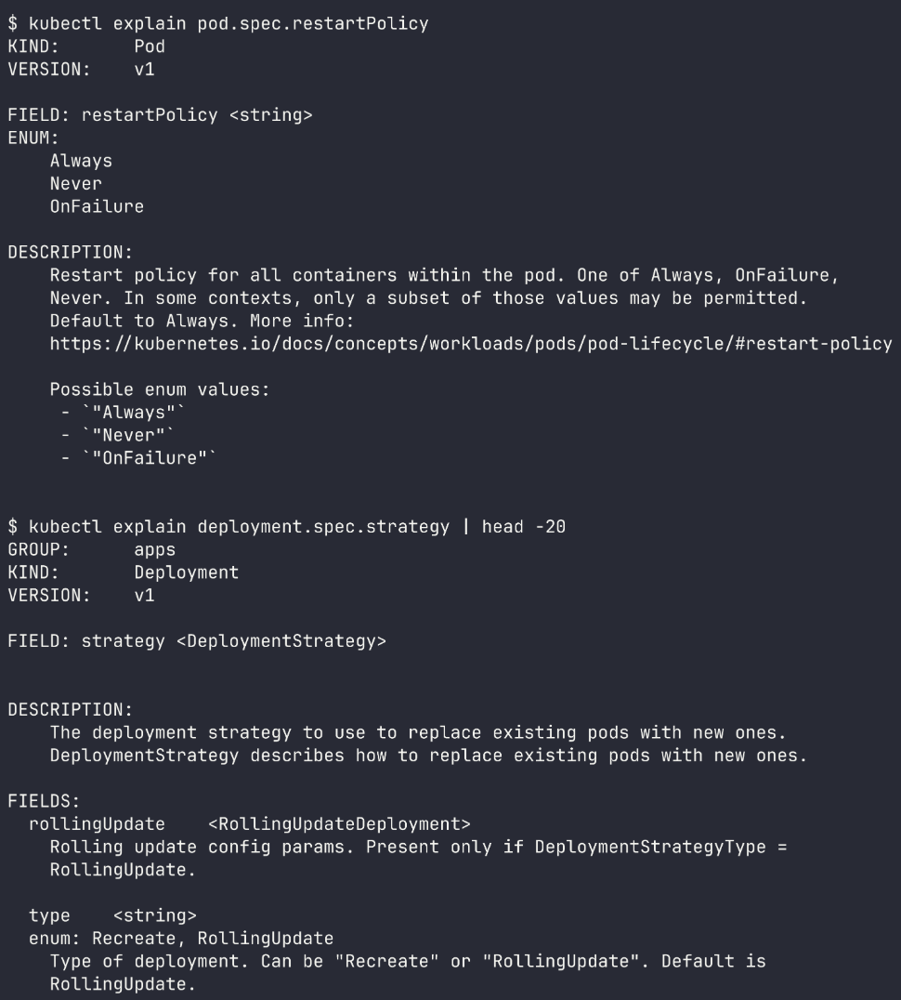

**kubectl top** - CPU/memory consumption of nodes and pods (requires metrics-server).

# Task 2: Troubleshoot Common Issues

For each issue the flow is: identify -> investigate -> root cause -> fix -> verify.

## 1. CrashLoopBackOff

Files: [06-crashloopbackoff/](06-crashloopbackoff/)

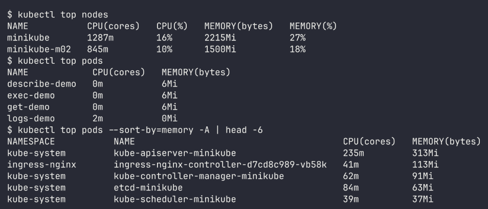

- **Problem:** the pod restarts over and over, status CrashLoopBackOff.
- **Investigation:** `logs` prints "Something went wrong!", and `describe` shows Last State Terminated with Exit Code 1.
- **Root cause:** the app command exits with code 1. Since restartPolicy is Always, kubelet keeps restarting it with increasing backoff.
- **Fix:** switched to the corrected command that keeps the app alive.

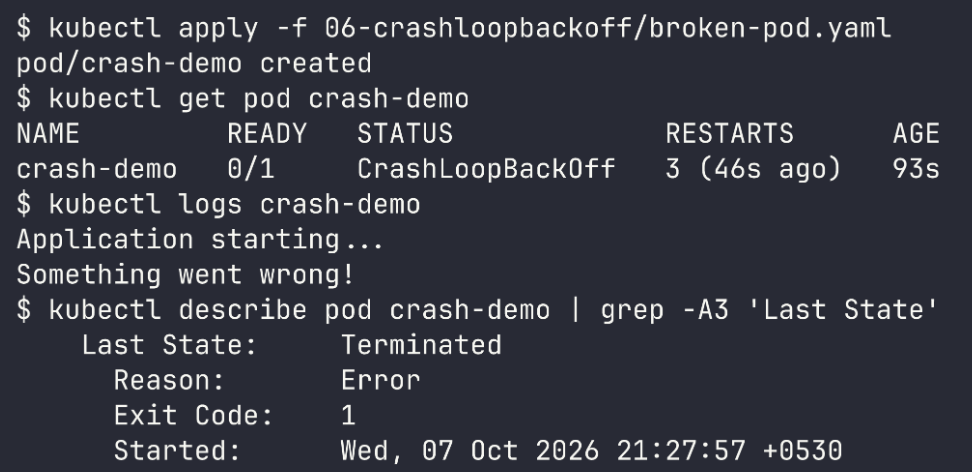

## 2. ErrImagePull / ImagePullBackOff

Files: [07-imagepullbackoff/](07-imagepullbackoff/)

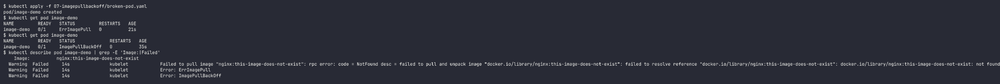

- **Problem:** it starts as `ErrImagePull`, then after a few retries becomes `ImagePullBackOff` (kubelet waits longer between attempts).
- **Investigation:** `describe` events show `nginx:this-image-does-not-exist: not found`.
- **Root cause:** incorrect image tag.
- **Fix:** switched to `nginx:1.27`.

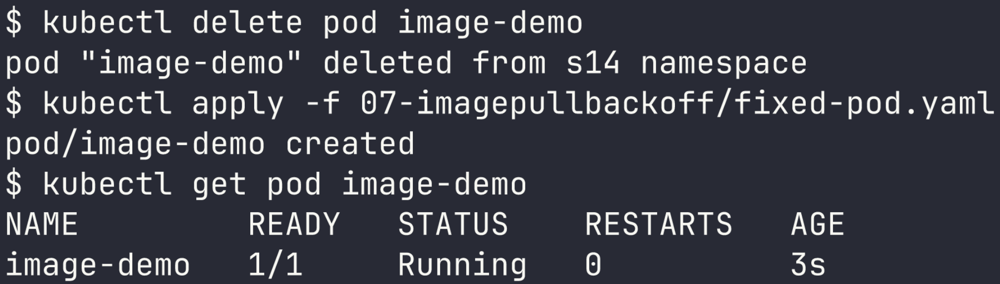

## 3. Pending

Files: [08-pending-pods/](08-pending-pods/)

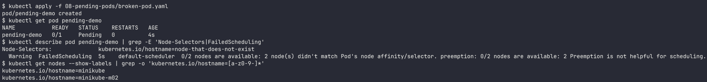

- **Problem:** the pod remains Pending with no node assigned.
- **Investigation:** `FailedScheduling: 2 node(s) didn't match Pod's node affinity/selector`.
- **Root cause:** the nodeSelector requests `node-that-does-not-exist`, whereas my nodes are `minikube` and `minikube-m02`.
- **Fix:** removed the invalid nodeSelector. (Other frequent causes: insufficient CPU/memory, taints, an unbound PVC.)

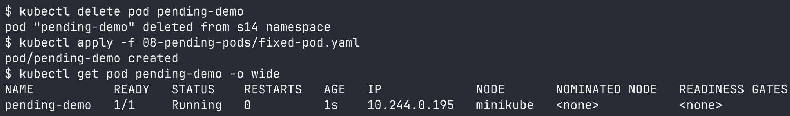

## 4. ContainerCreating

Files: [10-containercreating/](10-containercreating/) (made by me)

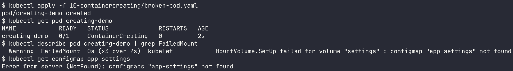

- **Problem:** the pod is stuck in ContainerCreating.
- **Investigation:** event `FailedMount ... configmap "app-settings" not found`.
- **Root cause:** the pod mounts a ConfigMap volume that doesn't exist.
- **Fix:** created the ConfigMap. kubelet retries the mount, so the pod came up by itself without needing a recreate.

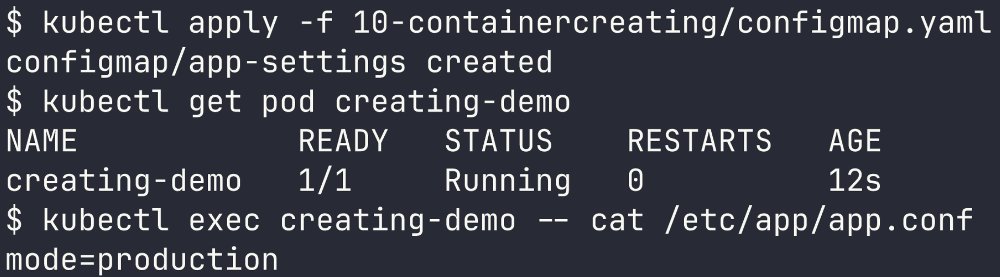

## 5. Service connectivity issue

Files: [09-service-dns-troubleshooting/deployment.yaml](09-service-dns-troubleshooting/deployment.yaml), [service.yaml](09-service-dns-troubleshooting/service.yaml)

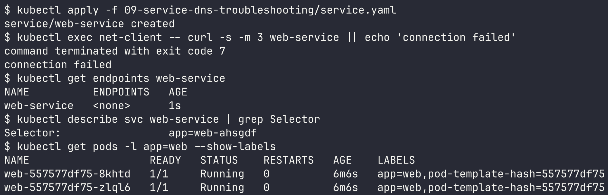

- **Problem:** curl to `web-service` fails.
- **Investigation:** endpoints are `<none>`. The service selector is `app=web-ahsgdf` but the pods carry `app=web`.
- **Root cause:** the selector doesn't match the pod labels, so the service has no backends.
- **Fix:** updated the selector to `app=web`.

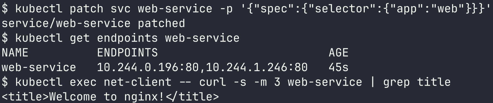

## 6. DNS issue

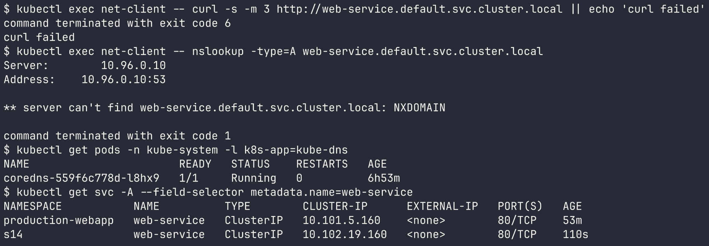

- **Problem:** the app calls `web-service.default.svc.cluster.local` and the name won't resolve (curl exit code 6).
- **Investigation:** `nslookup` returns NXDOMAIN. CoreDNS is up, so DNS itself is working. `kubectl get svc -A` shows `web-service` lives in `s14`, not `default`.
- **Root cause:** the wrong namespace in the FQDN.
- **Fix:** use `web-service.s14.svc.cluster.local` (or simply `web-service` from within the same namespace).

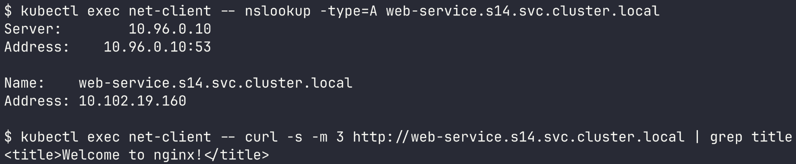

Note: the provided `dns-test-pod.yaml` image (`dnsutils:1.3`) is no longer available on registry.k8s.io, so I used a curl image pod instead (it includes `nslookup`).

## 7. Pod networking issue

Files: [11-pod-networking/](11-pod-networking/) (made by me)

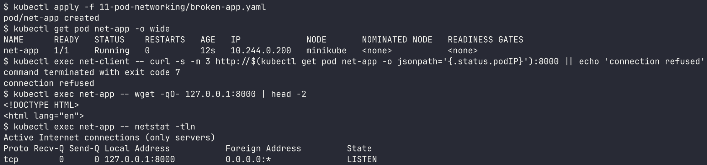

- **Problem:** the pod is Running and 1/1, yet other pods get "connection refused" on its IP:8000.
- **Investigation:** from inside the pod `127.0.0.1:8000` works. `netstat` shows it only listens on `127.0.0.1:8000`.
- **Root cause:** the app is bound to localhost, so it accepts connections only from within its own pod.
- **Fix:** bind to `0.0.0.0`.

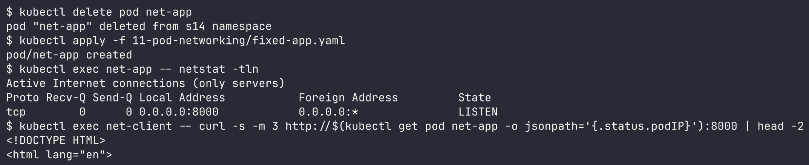

## 8. Configuration issue

Files: [12-config-issue/](12-config-issue/) (made by me)

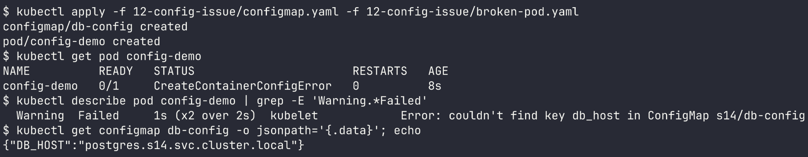

- **Problem:** the pod is in `CreateContainerConfigError`.
- **Investigation:** the event reads `couldn't find key db_host in ConfigMap s14/db-config`. The ConfigMap actually has `DB_HOST`.
- **Root cause:** wrong key name (keys are case sensitive).
- **Fix:** use `key: DB_HOST`.

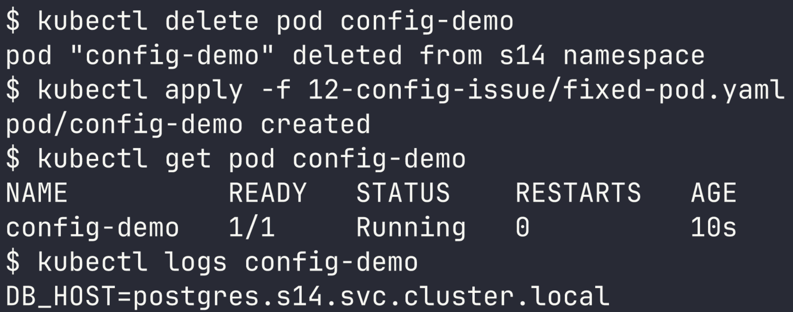

# Task 3: Mini Project

Files: [mini-project/](mini-project/)

**1. Deploy**

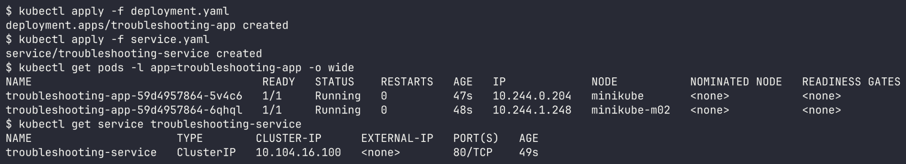

**2. Check the application**

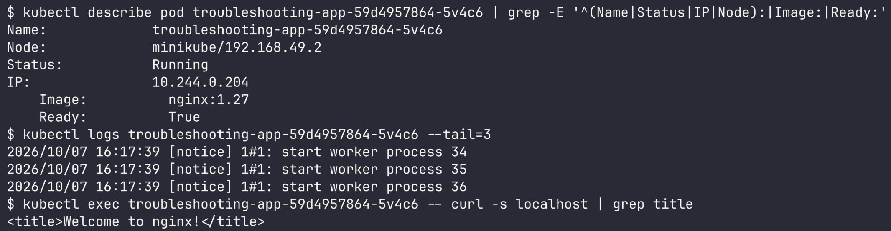

**3 & 4. Check service and endpoints**

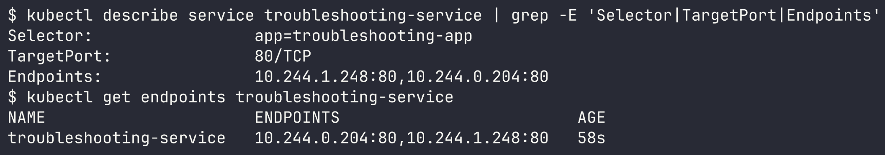

**5 & 6. Broken pod**

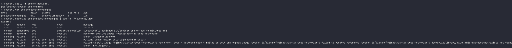

**7. Answers**

1. Pod status: `ImagePullBackOff` (preceded by `ErrImagePull`).
2. Actual error: `failed to resolve reference "docker.io/library/nginx:this-tag-does-not-exist": not found`.
3. Command: `kubectl describe pod project-broken-pod` (the Events section).
4. The `this-tag-does-not-exist` tag doesn't exist for the nginx image on Docker Hub.
5. Use a real tag. Since image is one of the few pod fields that can be edited, I changed it in place:

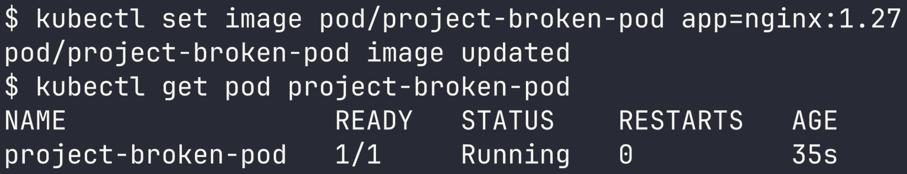

**8 & 9. Service selector challenge**

Set the selector to `app: wrong-app`. Endpoints turned to `<none>`, because the pod label `app=troubleshooting-app` no longer matched the selector `app=wrong-app`.

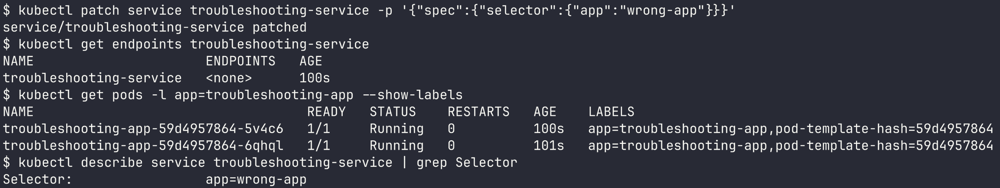

Resolved by reapplying the correct `service.yaml`:

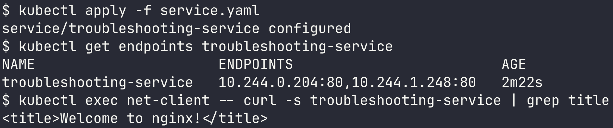

**11. Troubleshooting table**

| Problem | What I Saw | Command I Used | Root Cause | Fix |
| :--- | :--- | :--- | :--- | :--- |
| Broken Pod | `0/1 ImagePullBackOff` | `kubectl get pod`, `kubectl describe pod` | image tag does not exist | `kubectl set image` to `nginx:1.27` |
| Service Problem | endpoints `<none>`, curl fails | `kubectl get endpoints`, `kubectl get pods --show-labels`, `kubectl describe svc` | selector `app=wrong-app` doesn't match pod label | set selector back to `app: troubleshooting-app` |
| Image Problem | `ErrImagePull` then `ImagePullBackOff` | `kubectl describe pod` events | `not found` from Docker Hub | correct image name/tag |

**12. README questions**

1. **kubectl get:** a fast listing of resources and their current status (ready count, status, restarts, age).
2. **get vs describe:** `get` is a one line summary across many objects. `describe` is the full breakdown of one object, events included.
3. **kubectl logs:** to read what the app printed (errors, stack traces), especially the reason it crashed.
4. **kubectl exec:** when the pod is running and I need to inspect from inside, such as files, env vars, `curl localhost`, or DNS.
5. **CrashLoopBackOff:** the container launches then exits/crashes repeatedly, so kubelet waits progressively longer before each restart.
6. **ImagePullBackOff:** kubelet is unable to pull the image (wrong name/tag, private registry with no secret, network), so it backs off between retries.
7. **Pending:** the scheduler can't place the pod: too little CPU/memory, a nodeSelector/affinity mismatch, taints, or an unbound PVC.
8. **No endpoints:** the selector matches no pod labels, or the matching pods aren't Ready.
9. **Selector and labels:** a service routes traffic only to pods whose labels satisfy its selector. That's the sole connection between them.
10. **Kubernetes DNS:** CoreDNS assigns each service a name like `svc.namespace.svc.cluster.local`, letting pods reach services by name rather than IP.
