# Session 15 - Helm Homework

Helm v4.3.0, namespace `s15`.

# Task 1: Helm Commands

**helm repo** - add, update and list chart repositories.

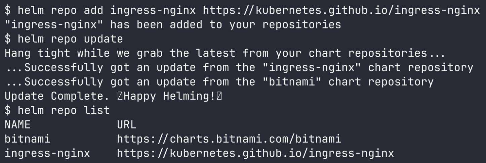

**helm search** - `search repo` queries the repos you've added, `search hub` queries Artifact Hub.

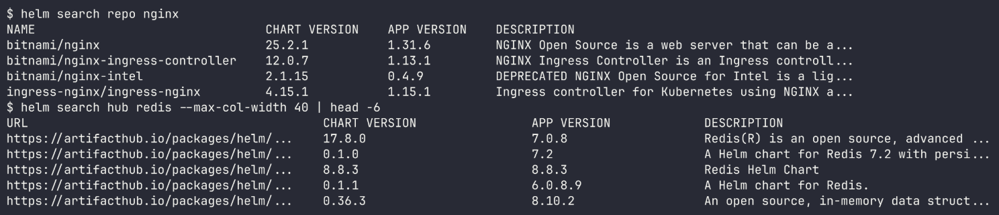

**helm create** - scaffolds a starter chart (Chart.yaml, values.yaml, templates). The chart lives in [helm-commands/mychart](helm-commands/mychart).

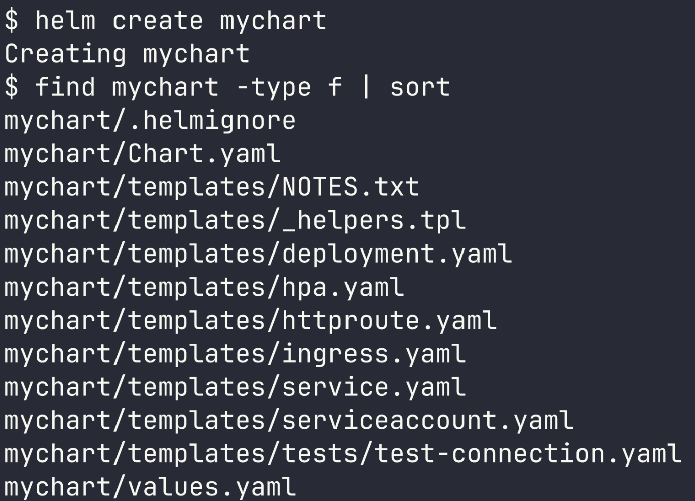

**helm install** - renders the templates with the values and creates a release (revision 1).

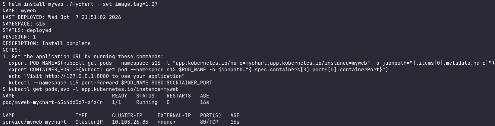

**helm list / helm status** - list all releases and show the status of a single release.

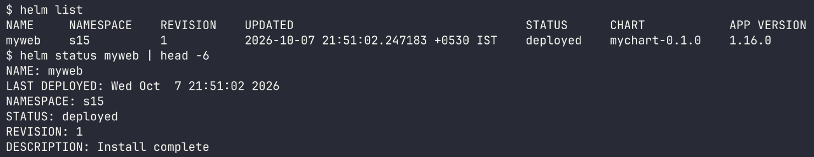

**helm get** - `get values` displays the values I supplied (`--all` shows them all), `get manifest` displays the final YAML that was applied.

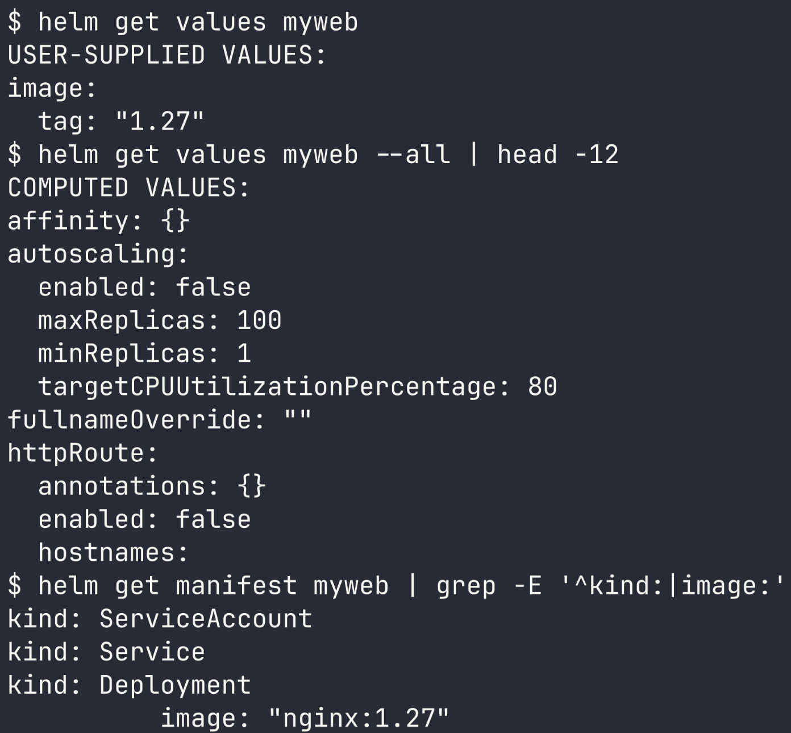

**helm upgrade / helm history** - upgrade modifies the release and records a new revision. History lists every revision.

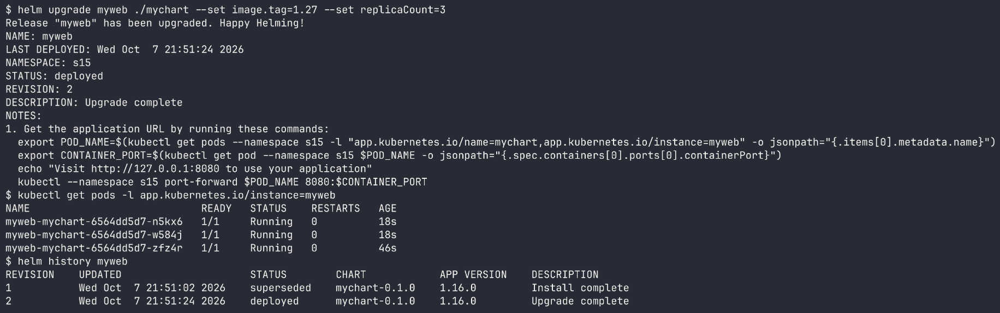

**helm rollback** - reverts to an earlier revision. It adds a new revision ("Rollback to 1") rather than erasing history.

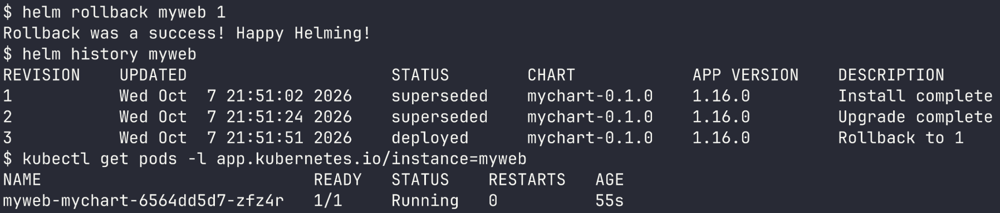

**helm uninstall** - removes every resource belonging to the release.

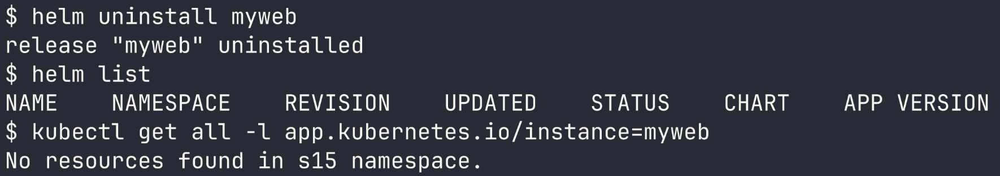

# Task 2: Helm Rollback

Chart: [07-install-upgrade/app-chart](07-install-upgrade/app-chart) (nginx, default tag 1.24)

**Install -> verify** (rev 1, nginx 1.24)

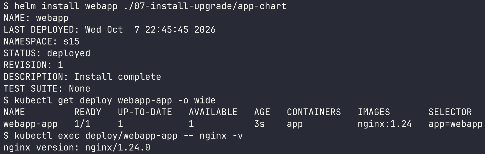

**Upgrade -> verify** (rev 2, nginx 1.25)

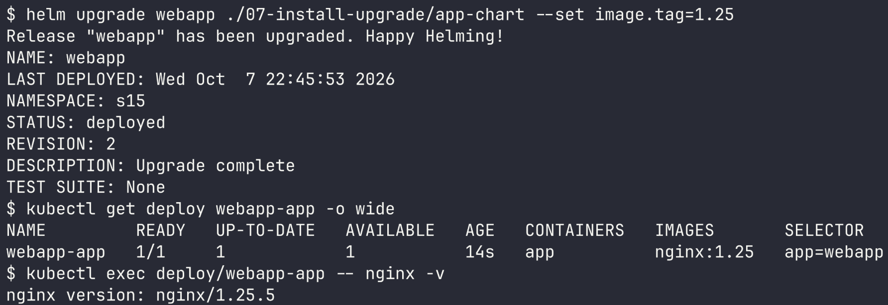

**Upgrade again -> verify** (rev 3, nginx 1.27, 3 replicas)

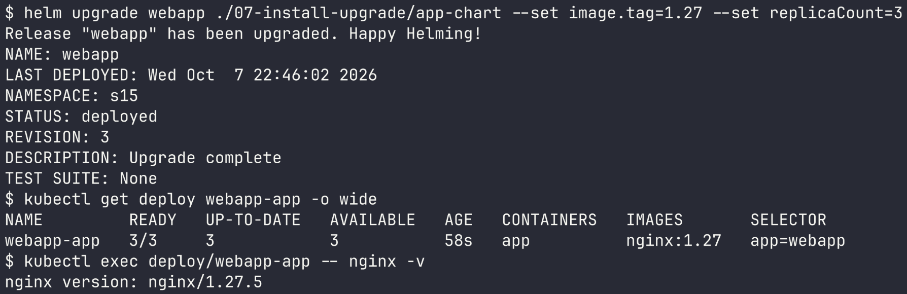

**Rollback -> verify** (back to rev 2: nginx 1.25, 1 replica)

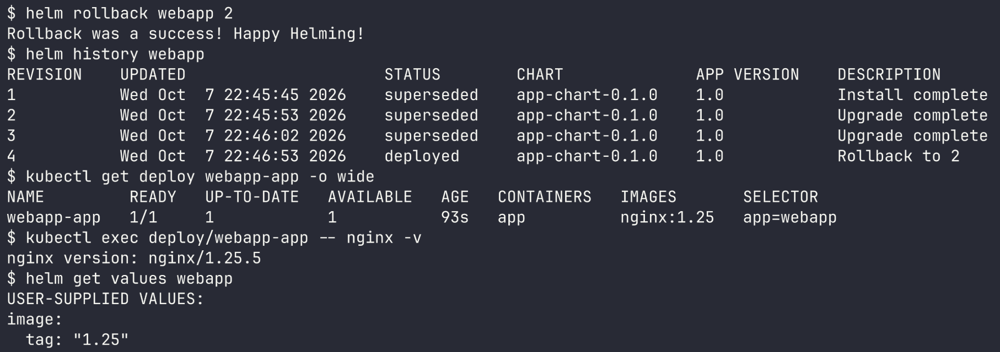

The rollback produced revision 4 carrying the same values as revision 2 (`image.tag=1.25`). Both the image and the replica count reverted.

# Task 3: Mini Project - Notes App chart

Chart: [mini-project/notes-chart](mini-project/notes-chart) (Chart.yaml, values.yaml, values-prod.yaml, templates for deployment, service, configmap)

**Lint and render**

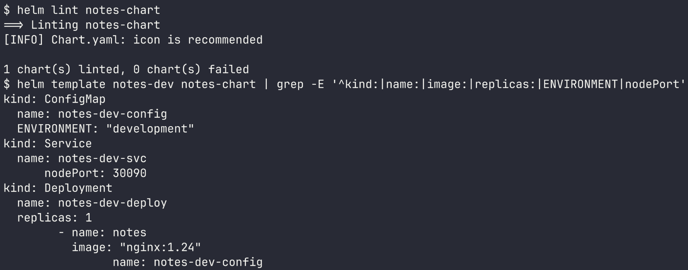

**Install (development values)** - 1 replica, nginx 1.24, ENVIRONMENT=development, NodePort 30090

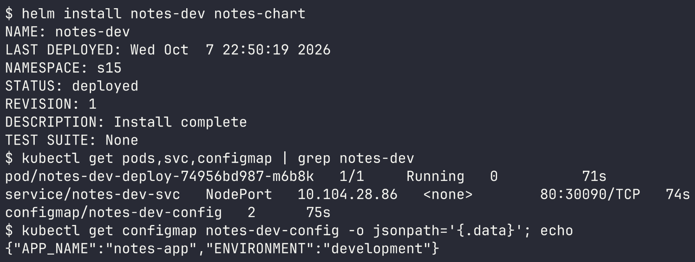

**Upgrade with production values** - 3 replicas, nginx 1.25, ENVIRONMENT=production

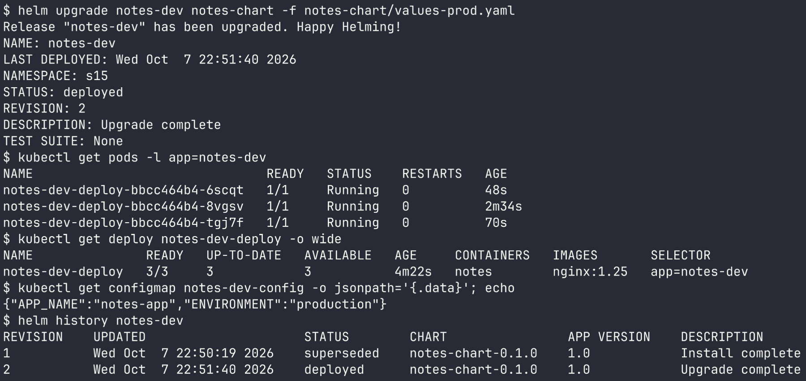

**Bad upgrade** - broken image tag. The new pod lands in ImagePullBackOff, but thanks to the rolling update the old pods keep serving, so the app stays available.

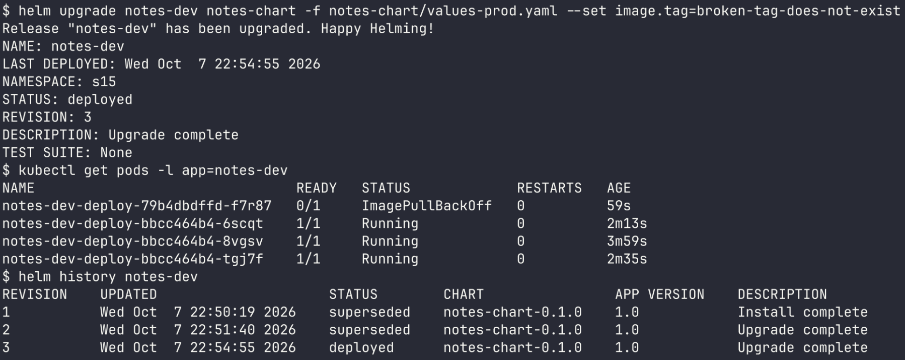

**Rollback to revision 2** - the broken pod is terminating while the 3 healthy pods remain.

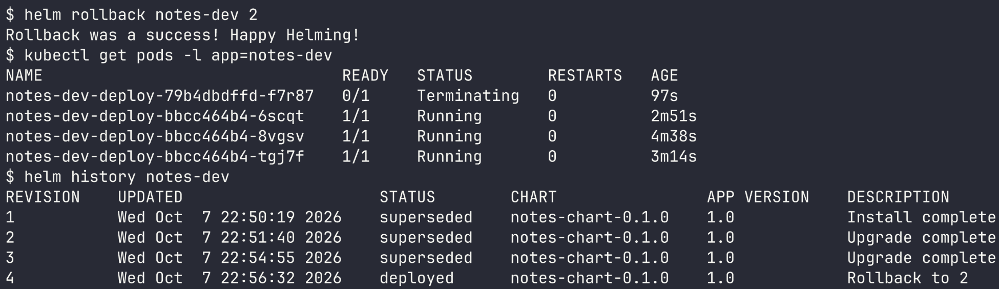

**Clean up**

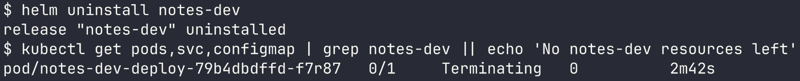

The release is gone. The pod from the failed upgrade is still winding down (Terminating) and gets deleted a few seconds afterward.
