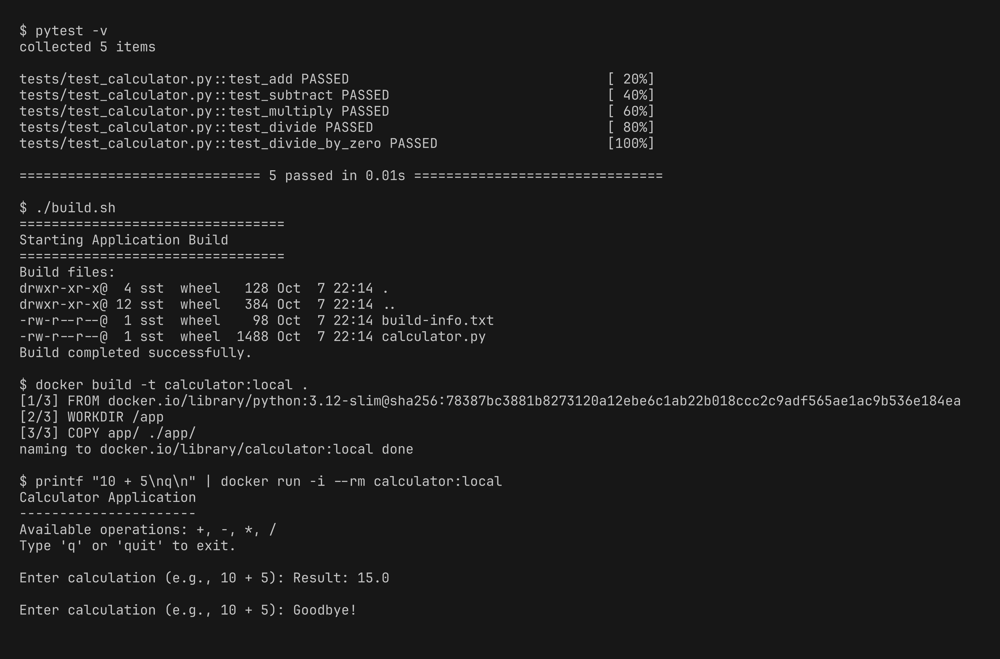
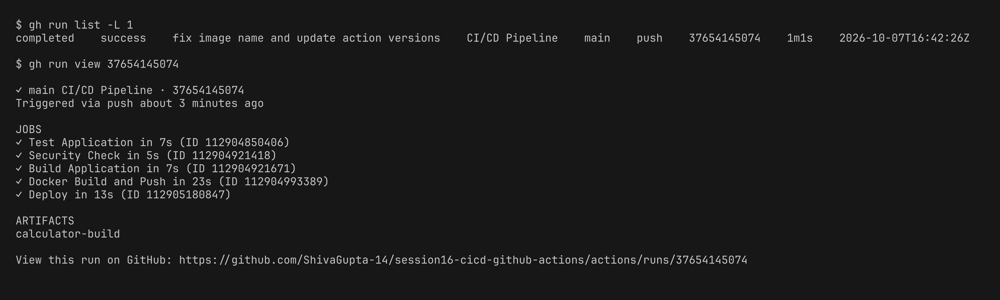

# Session 16 - CI/CD & GitHub Actions Homework

Demo project: a compact Python calculator app wired up with a complete CI/CD pipeline on GitHub Actions.


| Deliverable | File |
|---|---|
| Application source code | [app/calculator.py](mini-project/app/calculator.py) |
| Unit tests | [tests/test_calculator.py](mini-project/tests/test_calculator.py) |
| Build script | [build.sh](mini-project/build.sh) |
| Dockerfile | [Dockerfile](mini-project/Dockerfile) |
| GitHub Actions workflow (CI + CD) | [.github/workflows/ci.yml](mini-project/.github/workflows/ci.yml) |

## Concepts

- **CI vs CD** - CI means each push is tested and built automatically. CD means the tested build is then packaged and delivered/deployed automatically.
- **CI/CD pipeline** - the sequence of stages: test -> security check -> build -> docker image -> push -> deploy. When a stage fails, the following ones are skipped.
- **GitHub Actions** - a CI/CD service baked into GitHub. Workflows are YAML files kept under `.github/workflows/`.
- **Workflow** - `ci.yml`, fired on `push` to main, `pull_request` and `workflow_dispatch` (manual run).
- **Jobs** - `test`, `security-check`, `build`, `docker`, `deploy`. Their ordering comes from `needs`. `security-check` and `build` run side by side once `test` completes.
- **Steps** - the commands or actions within a job (`actions/checkout`, `actions/setup-python`, `run: pytest -v`, etc).
- **Runners** - every job uses `runs-on: ubuntu-latest` (a GitHub hosted VM). Each job starts on a fresh runner.
- **Secrets** - `secrets.GITHUB_TOKEN` handles the login to GitHub Container Registry (GHCR). It never appears in the code.
- **Artifacts** - the `build/` folder is uploaded as the `calculator-build` artifact via `actions/upload-artifact`.
- **Build** - `build.sh` produces the build folder, and `docker build` produces the image.
- **Test** - `pytest` executes 5 unit tests. The build proceeds only when the tests pass.

## Pipeline Flow

```
git push -> Test -> Security Check + Build (artifact) -> Docker Build & Push (GHCR) -> Deploy
            |------------------- CI ------------------|  |--------------- CD ---------------|
```

- **CI part:** test, security-check, build
- **CD part:** the `docker` job builds the image, tests it, and pushes it to `ghcr.io/shivagupta-14/calculator`. The `deploy` job (environment `production`) then pulls that image from GHCR and runs it.

## Running Locally

Before pushing, I ran the identical steps on my machine: tests, the build script, and the docker image.

```bash
pip install -r requirements.txt
pytest -v
./build.sh
docker build -t calculator:local .
printf "10 + 5\nq\n" | docker run -i --rm calculator:local
```



## Pipeline Execution

After pushing to GitHub, the workflow kicked off on its own. All 5 jobs passed and the artifact was uploaded.



## CD: Docker Push and Deploy

The steps of the docker and deploy jobs. The deploy job ran the image and returned `Result: 60.0` for `20 * 3`. I also pulled that same image from GHCR onto my own machine and ran it.


