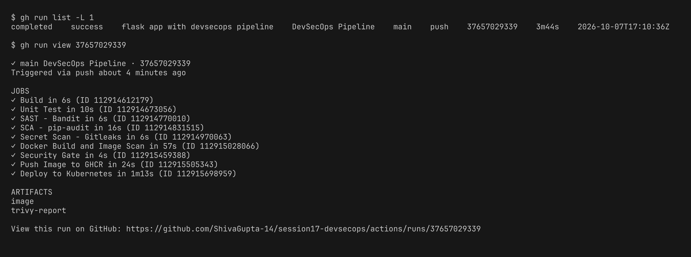
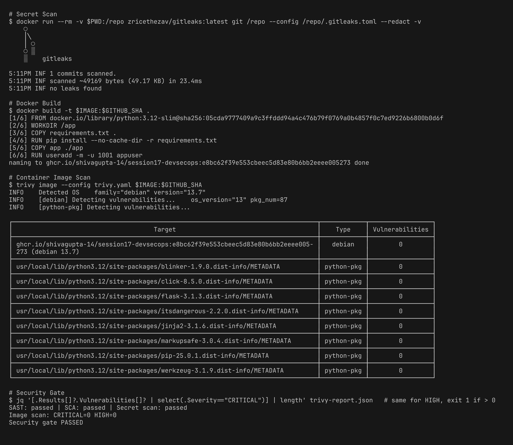

# Session 17 - Complete CI/CD & DevSecOps Homework

Demo project: a Flask app (DevSecOps Dashboard) running a complete CI/CD + DevSecOps pipeline on GitHub Actions. The app code comes from the session's `demo/` folder.

| Deliverable | File |
|---|---|
| Application | [app/app.py](mini-project/app/app.py), [tests/test_app.py](mini-project/tests/test_app.py) |
| Dockerfile | [Dockerfile](mini-project/Dockerfile) |
| GitHub Actions workflow | [.github/workflows/devsecops.yml](mini-project/.github/workflows/devsecops.yml) |
| Security tools config | [.bandit](mini-project/.bandit), [.gitleaks.toml](mini-project/.gitleaks.toml), [trivy.yaml](mini-project/trivy.yaml) |
| Kubernetes manifests | [k8s/deployment.yaml](mini-project/k8s/deployment.yaml), [k8s/service.yaml](mini-project/k8s/service.yaml) |

## Pipeline Flow

Each stage is its own job and only executes when the preceding one has passed (`needs`).

```
Code -> Build -> Unit Test -> SAST -> SCA -> Secret Scan -> Docker Build -> Image Scan -> Security Gate -> Push Image -> Deploy to K8s
```

| Stage | Tool | What it does |
|---|---|---|
| Build | python | installs dependencies, compiles the code and imports the app |
| Unit Test | pytest + pytest-cov | 8 tests along with a coverage report |
| SAST | Bandit | scans the source for security issues, failing on medium/high |
| SCA | pip-audit | checks the `requirements.txt` packages for known CVEs |
| Secret Scan | Gitleaks | sweeps the entire git history for passwords, tokens, keys |
| Docker Build | docker | builds an image tagged with the commit SHA |
| Image Scan | Trivy | scans OS and python packages inside the image (HIGH, CRITICAL) |
| Security Gate | jq on trivy report | halts the release when any fixable HIGH/CRITICAL vuln shows up |
| Push Image | GHCR | pushes `ghcr.io/shivagupta-14/session17-devsecops:<sha>` and `:latest` |
| Deploy | kind + kubectl | spins up a kind cluster on the runner, deploys 2 replicas, verifies with curl |

## Changes I made to the demo

- Dropped `debug=True` from `app.run()`. Bandit marks it HIGH (B201) since Flask debug mode permits code execution. Debug now turns on only when `FLASK_DEBUG=1`.
- The Dockerfile runs as a non-root user (uid 1001) and uses `--no-cache-dir`.
- Added a `.bandit` config: skipped B104 (the app has to bind 0.0.0.0 inside a container) and B311 (random is only used for demo greetings).
- Added `.gitleaks.toml` (default rules) and `trivy.yaml` (HIGH/CRITICAL, ignore unfixed).
- Introduced the Build, Secret Scan and Security Gate stages that the demo workflow was missing.
- The image is pushed to GHCR with `secrets.GITHUB_TOKEN` rather than a Docker Hub account. That same token also creates an `imagePullSecret` in the cluster.
- The Deployment includes a readiness probe on `/health`, resource requests/limits and `runAsNonRoot`.

## Successful Pipeline Run

All 9 jobs passed (the docker build and image scan happen in the same job).



## Build, Unit Test, SAST, SCA


## Secret Scan, Docker Build, Image Scan, Security Gate

No leaks and 0 HIGH/CRITICAL vulnerabilities in the image, so the gate let it through.



## Push to Registry and Deploy to Kubernetes

Image pushed to GHCR and deployed on a kind cluster, with both pods Running and the app responding on `/health` and `/api/status`.


