SCREENSHOT 1: Show the 3 running Pods.
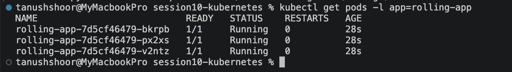

SCREENSHOT 2: Show the new Pods after the update.
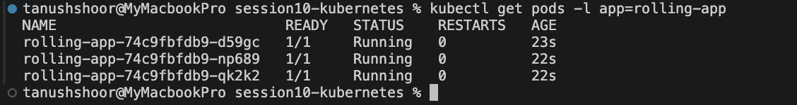

SCREENSHOT 3: Show Blue + Green Pods and the Service.
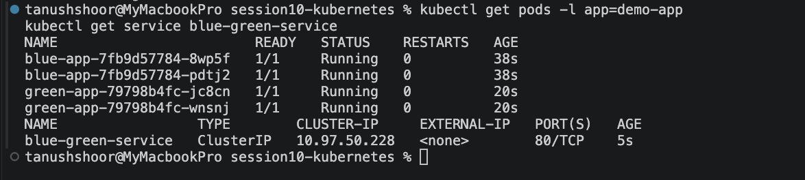

SCREENSHOT 4: Show that the Service selector is now version: green.
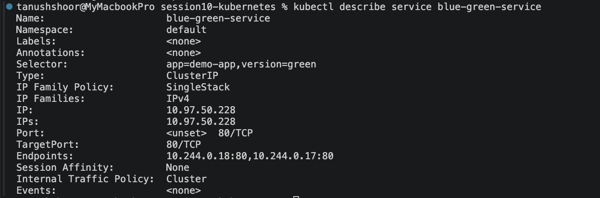

SCREENSHOT 5: Show 9 stable + 1 canary Pod.
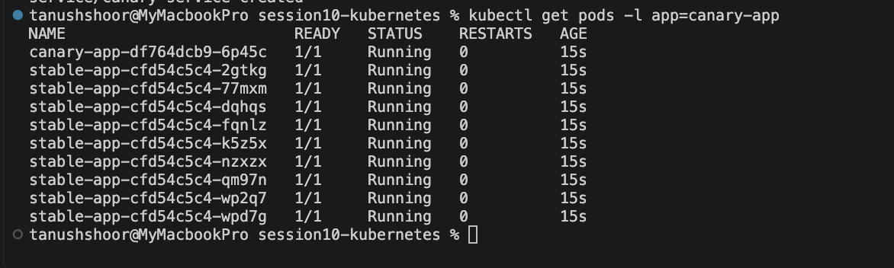

SCREENSHOT 6: Show the initial 3 Pods.

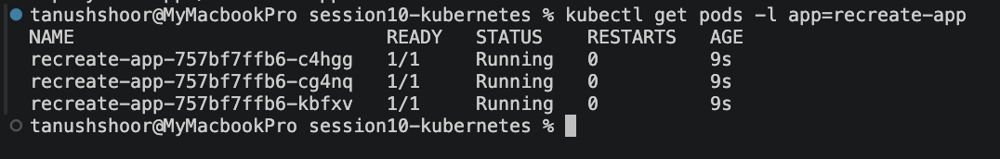

SCREENSHOT 7: Show that the old Pods were terminated and new Pods were created.
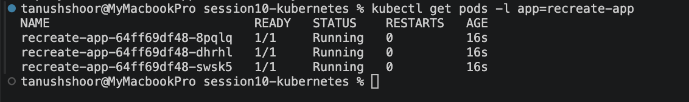

SCREENSHOT 8: Pod should show Pending.
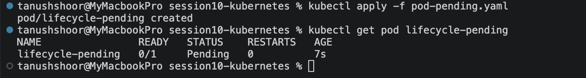

SCREENSHOT 9: Show the scheduling/event information explaining why it is Pending.
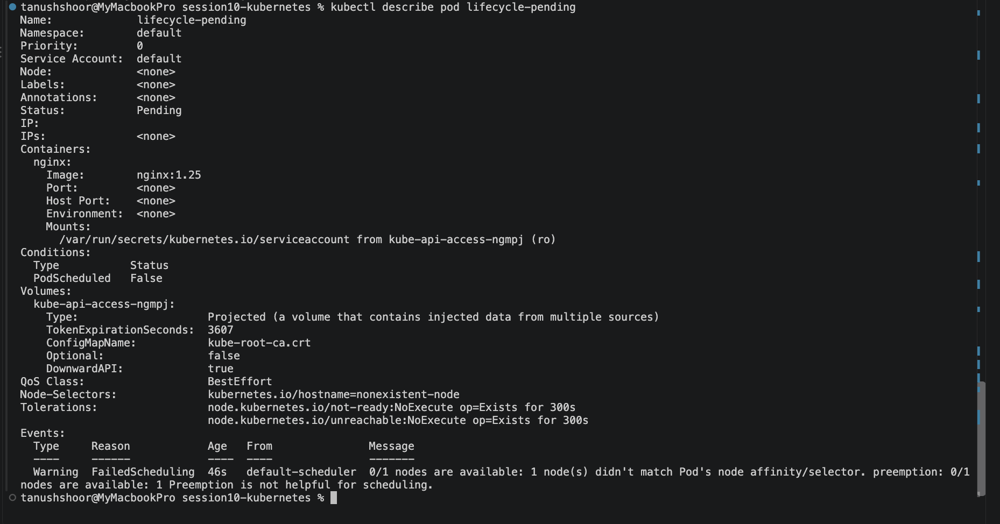

SCREENSHOT 10: Pod should show Running.
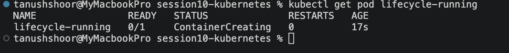

SCREENSHOT 11: Show Pod details.
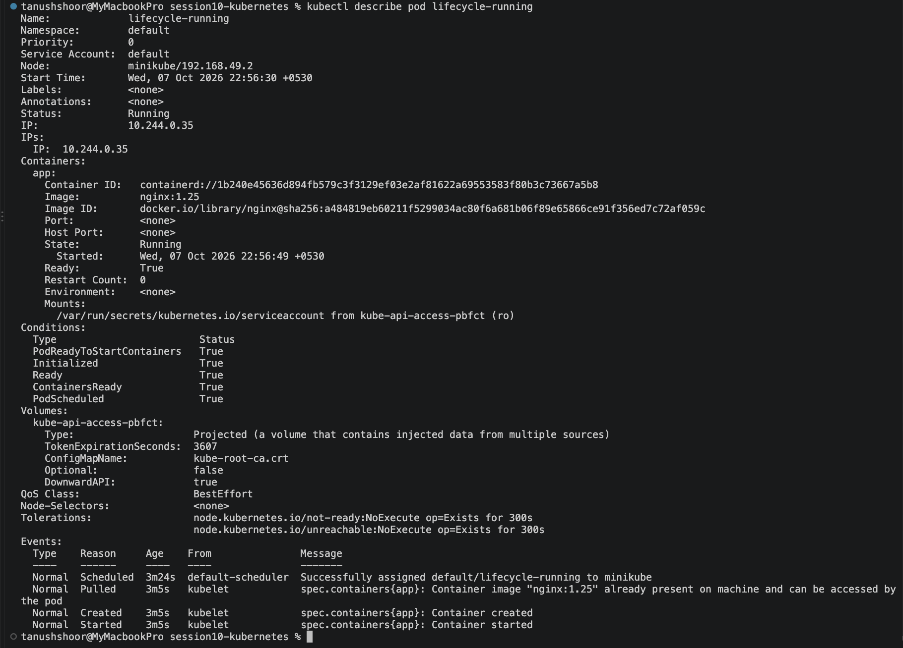

SCREENSHOT 12: Pod should show Completed.
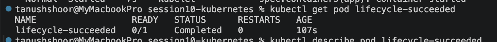

SCREENSHOT 13: Show the completed Pod details.
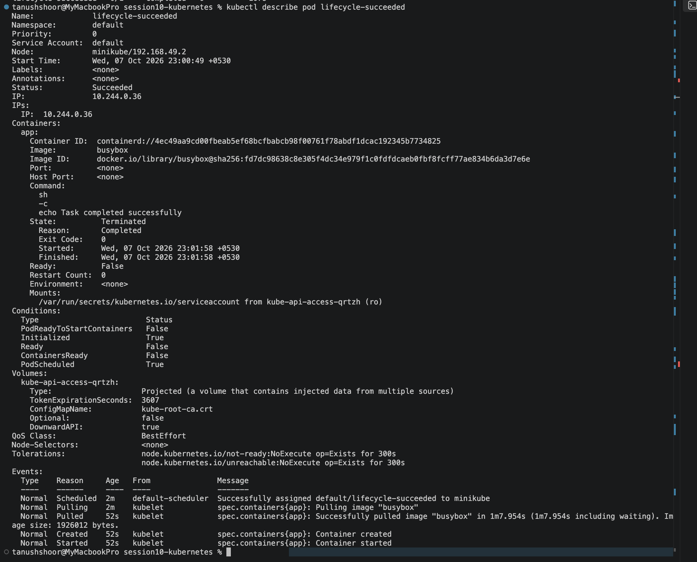

SCREENSHOT 14: Pod should show Failed.
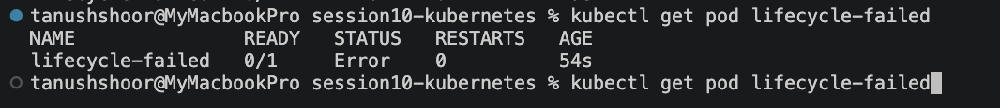

SCREENSHOT 15: Show the failure information.