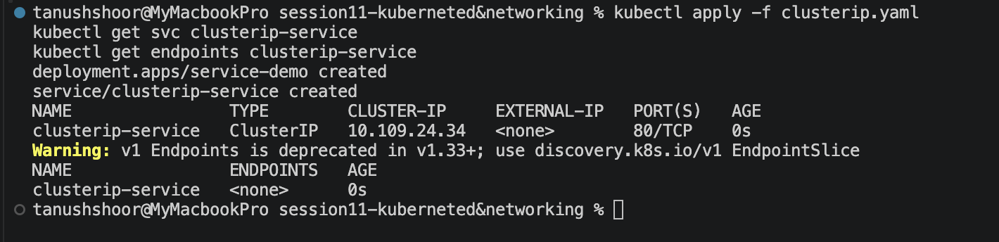
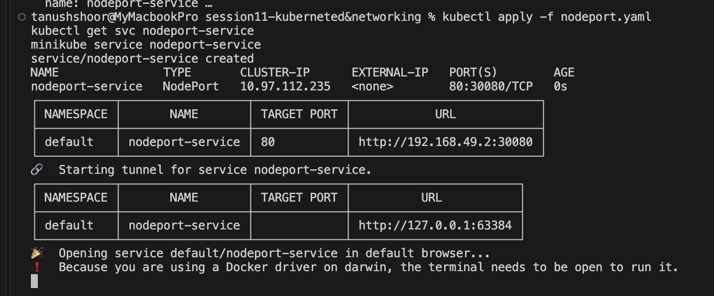
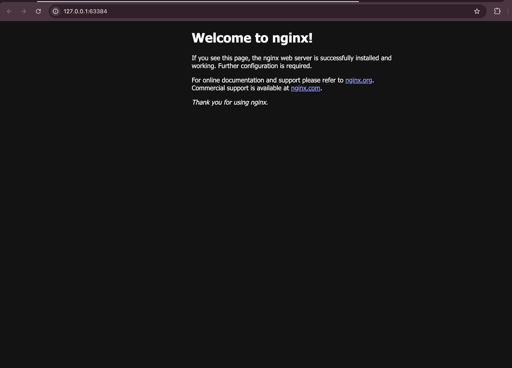
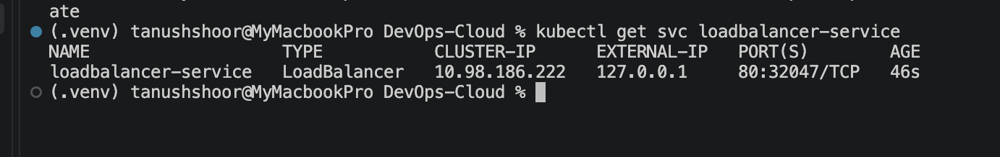
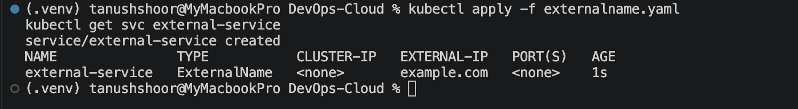
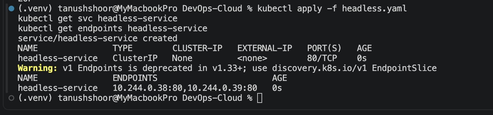
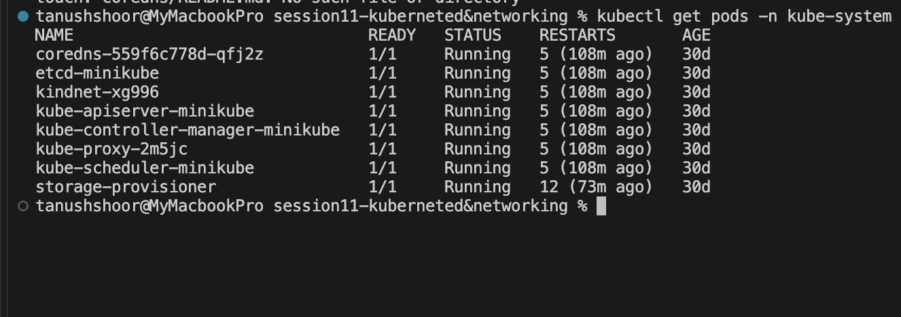
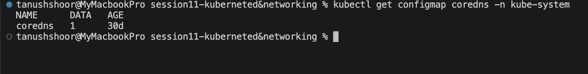
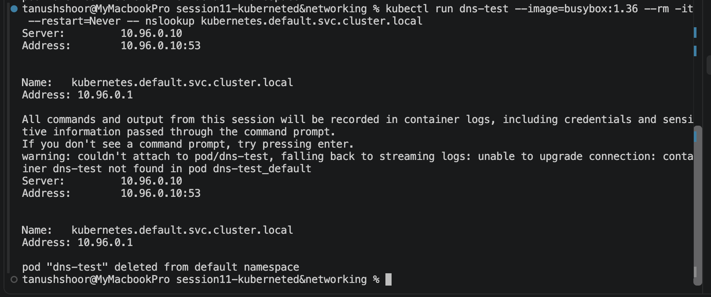

# Session 11: Kubernetes Networking & Services

## Student Details

**Name:** Tanush Shoor  
**Course:** DevOps  
**Topic:** Kubernetes Networking & Services

---

# Task 1 — Kubernetes Services

Kubernetes Services provide stable networking and service discovery for applications running inside a cluster. The following five Service types were demonstrated:

1. ClusterIP
2. NodePort
3. LoadBalancer
4. ExternalName
5. Headless Service

---

## 1. ClusterIP

ClusterIP is the default Service type. It provides an internal IP address through which Pods can be accessed within the Kubernetes cluster.

### Commands

```bash
kubectl apply -f clusterip.yaml
kubectl get svc clusterip-service
kubectl get endpoints clusterip-service
```

📸 Screenshot 1: Both commands' output.


##  2. NodePort
NodePort exposes a Service on a port of the Kubernetes node, allowing the application to be accessed externally.

Commands
```bash
kubectl apply -f nodeport.yaml
kubectl get svc nodeport-service
minikube service nodeport-service
```
The NodePort Service was successfully created and the application was accessed through the browser.

📸 Screenshot 2: kubectl get svc + browser.



### 3. LoadBalancer
LoadBalancer exposes a Service externally using a load balancer. In Minikube, the LoadBalancer Service can be used with minikube tunnel.
Commands
kubectl apply -f loadbalancer.yaml
kubectl get svc loadbalancer-service
minikube tunnel

The LoadBalancer Service was successfully created and verified.
📸 Screenshot 3: LoadBalancer output.


### 4. ExternalName
ExternalName maps a Kubernetes Service to an external DNS name. It does not create a ClusterIP or select Pods.
Commands
kubectl apply -f externalname.yaml
kubectl get svc external-service

The ExternalName Service was successfully created and mapped to the configured external domain.

📸 Screenshot 4: ExternalName output.



### 5. Headless Service
A Headless Service is created with clusterIP: None. Instead of providing a single ClusterIP, DNS resolution can return the individual Pod addresses.
Commands
kubectl apply -f headless.yaml
kubectl get svc headless-service
kubectl get endpoints headless-service

The Headless Service and its endpoints were successfully verified.

📸 Screenshot 5: Service + endpoints.


# Task 2 — Kubernetes Object Comparison
## Deployment vs ReplicaSet
| Feature | Deployment | ReplicaSet |
|---|---|---|
| Purpose | Manages application deployments | Maintains the desired number of Pods |
| Pod Management | Manages ReplicaSets which manage Pods | Directly manages Pods |
| Scaling | Supports scaling | Supports scaling |
| Rolling Updates | Supported | Not directly supported |
| Relationship | Creates and manages ReplicaSets | Usually managed by a Deployment |

A Deployment provides higher-level management of applications, while a ReplicaSet ensures that the specified number of Pod replicas are running.

## Deployment vs DaemonSet vs StatefulSet
| Feature | Deployment | DaemonSet | StatefulSet |
|---|---|---|---|
| Use Case | Stateless applications | Node-level services | Stateful applications |
| Pod Creation | Creates configurable replicas | Creates a Pod on each eligible node | Creates uniquely identified Pods |
| Scaling | Replica based | Node based | Replica based |
| Networking | Usually through Services | Usually through Services | Stable network identities |
| Storage | Usually optional | Optional | Persistent storage commonly used |
| Example | Web server | Monitoring/logging agent | Database |

Deployment
Deployments are commonly used for stateless applications where Pods are interchangeable.
DaemonSet
DaemonSets ensure that a Pod runs on each eligible node. They are commonly used for monitoring, logging and node-level agents.
StatefulSet
StatefulSets are used for applications that require stable identities, persistent storage and ordered deployment.

## ReplicaSet vs Service
| Feature | ReplicaSet | Service |
|---|---|---|
| Responsibility | Maintains the desired number of Pods | Provides stable network access to Pods |
| Main Function | Pod availability | Pod connectivity |
| Scaling | Maintains Pod replicas | Does not create Pods |
| Traffic | Does not route application traffic | Routes traffic to matching Pods |

A ReplicaSet ensures that the required number of Pods are running.
A Service provides a stable endpoint for accessing those Pods. It uses label selectors to identify matching Pods and forwards traffic to them.


# Task 3 — FQDN
What is FQDN?
FQDN stands for Fully Qualified Domain Name. It identifies a resource using its complete DNS name.
Kubernetes Service DNS
Kubernetes automatically creates DNS records for Services. This allows Pods to communicate with Services using DNS names instead of hard-coded IP addresses.
Kubernetes DNS Naming Convention
The general Service FQDN format is:
<service-name>.<namespace>.svc.cluster.local

Example:
my-service.default.svc.cluster.local

Namespace-Based DNS
Within the same namespace, a Service can usually be accessed using:
my-service

A namespace can also be specified:
my-service.my-namespace

The complete FQDN is:
my-service.my-namespace.svc.cluster.local

Pod-to-Service Communication
A Pod can communicate with another application through the Service DNS name.
```bash 
Pod
 |
 | DNS Query
 v
CoreDNS
 |
 v
Service
 |
 v
Backend Pods
```

Examples of Kubernetes FQDNs:
web.default.svc.cluster.local
database.production.svc.cluster.local
api.backend.svc.cluster.local


# Task 4 — CoreDNS
What is CoreDNS?
CoreDNS is the DNS server used by Kubernetes for service discovery inside the cluster.
Why Kubernetes Uses CoreDNS
CoreDNS provides automatic DNS resolution for Kubernetes Services and other cluster resources. This allows applications to communicate using stable DNS names instead of relying on changing Pod IP addresses.
Service Discovery
When a Service is created, Kubernetes creates a corresponding DNS record. A Pod sends a DNS query, CoreDNS resolves the Service name and returns the appropriate address.

```bash
Application Pod
      |
      | DNS Query
      v
    CoreDNS
      |
      v
 Kubernetes Service
      |
      v
 Backend Pods
```
DNS Query Resolution
1. A Pod sends a DNS query.
2. The query is sent to the Kubernetes DNS Service.
3. CoreDNS receives the query.
4. CoreDNS resolves the Kubernetes resource.
5. The appropriate address is returned.
6. The application uses the address to communicate.
CoreDNS Configuration
CoreDNS runs in the kube-system namespace.
The following commands were used to verify CoreDNS:
kubectl get pods -n kube-system
kubectl get configmap coredns -n kube-system

The CoreDNS Pods were running successfully.

📸 Screenshot 6: CoreDNS Pods showing Running.


The CoreDNS ConfigMap was also verified.
📸 Screenshot 7: CoreDNS ConfigMap.


DNS Troubleshooting
The following commands can be used to troubleshoot Kubernetes DNS:
kubectl get pods -n kube-system
kubectl get service -n kube-system
kubectl get configmap coredns -n kube-system
kubectl logs -n kube-system -l k8s-app=kube-dns

A DNS test was performed using a temporary BusyBox Pod:
kubectl run dns-test --image=busybox:1.36 --rm -it --restart=Never -- nslookup kubernetes.default.svc.cluster.local

The DNS query was successfully resolved by the Kubernetes DNS system.
📸 Screenshot 8: Successful nslookup.
