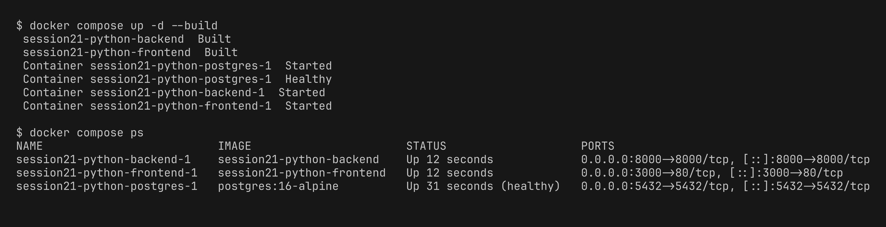

# Session 21 - TaskBoard with Docker Compose

The TaskBoard app is made up of 3 components:

- **frontend** - React + Vite, packaged through a multi-stage [Dockerfile](frontend/Dockerfile) (node build -> nginx). Nginx additionally proxies `/api` through to the backend.
- **backend** - FastAPI, whose [Dockerfile](backend/Dockerfile) runs `alembic upgrade head` and then launches uvicorn on port 8000 as a non-root user.
- **postgres** - `postgres:16-alpine` backed by a named volume for its data.

All three are wired together in [docker-compose.yml](docker-compose.yml).

**Fix I made:** the backend kept crashing on the very first start because it attempted the migration before postgres was ready (`connection refused`). I added a `pg_isready` healthcheck to postgres and set `condition: service_healthy` on the backend's `depends_on`.

## 1. Start the stack

```bash
cd session21-python
docker compose up -d --build
docker compose ps
```



## 2. Test backend APIs

Verified health, created two tasks via POST, then listed them and pulled the stats.

```bash
curl -X GET http://localhost:8000/health
curl -X POST http://localhost:8000/api/tasks -H 'Content-Type: application/json' -d '{"title":"Setup CI pipeline","priority":"HIGH","assignee":"Shiva"}'
curl -X GET http://localhost:8000/api/tasks
curl -X GET http://localhost:8000/api/tasks/stats
```


## 3. Application in browser

The TaskBoard UI at http://localhost:3000 displaying the tasks created above.


Swagger UI at http://localhost:8000/docs listing all the endpoints.


